# E-Paper Display Library - Architecture Documentation

## Table of Contents
1. [System Overview](#system-overview)
2. [Architecture Layers](#architecture-layers)
3. [Component Details](#component-details)
4. [Class Diagrams](#class-diagrams)
5. [Sequence Diagrams](#sequence-diagrams)
6. [Data Flow](#data-flow)
7. [Error Handling](#error-handling)
8. [Design Patterns](#design-patterns)
9. [Hardware Abstraction](#hardware-abstraction)

---

## System Overview

This library provides a modern C++23 interface for controlling Waveshare e-paper displays on Raspberry Pi. The architecture follows clean separation of concerns with distinct layers handling hardware communication, display control, framebuffer management, and high-level drawing operations.

### Key Design Principles
- **Layered Architecture**: Clear separation between hardware, driver, framebuffer, and drawing layers
- **RAII Pattern**: Automatic resource management throughout
- **Composition Over Inheritance**: Minimal inheritance hierarchy
- **Modern C++ Features**: `std::expected`, `std::span`, strong typing
- **Type Safety**: Enums and type-safe wrappers prevent common errors
- **Zero-Cost Abstractions**: Modern interfaces with no runtime overhead

---

## Architecture Layers

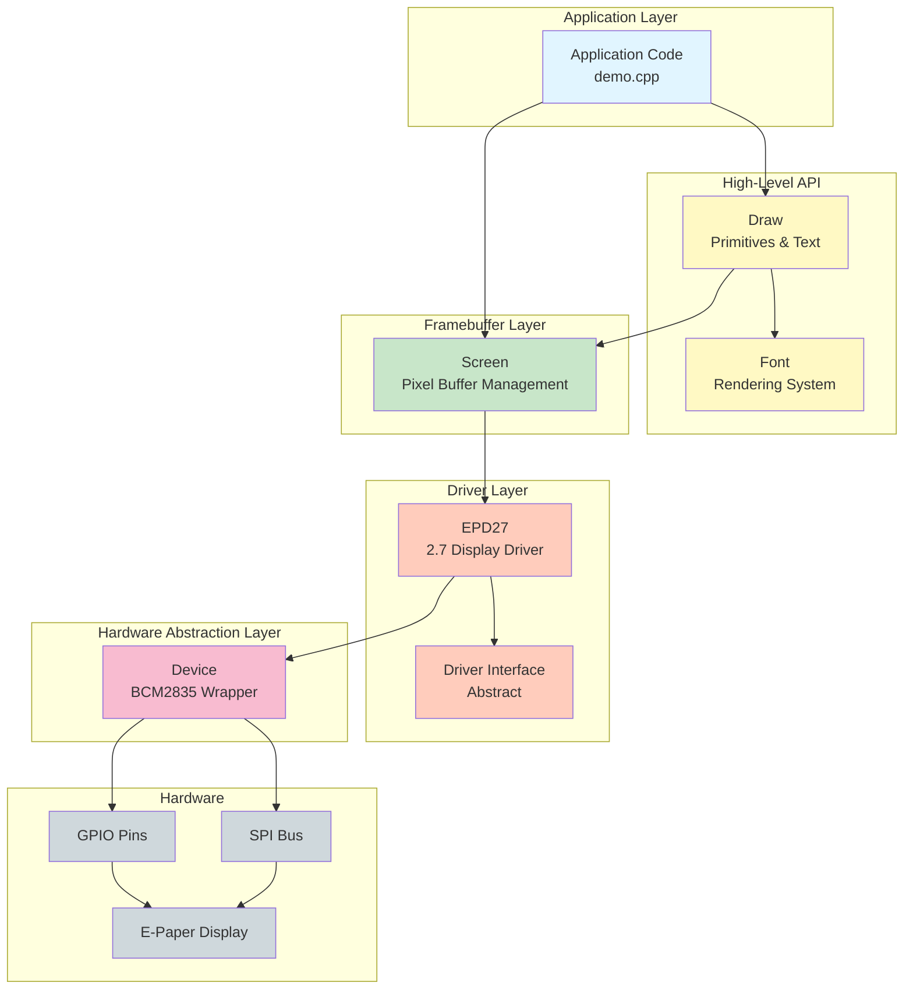
```mermaid
graph TB
    subgraph "Application Layer"
        APP[Application Code<br/>demo.cpp]
    end

    subgraph "High-Level API"
        DRAW[Draw<br/>Primitives & Text]
        FONT[Font<br/>Rendering System]
    end

    subgraph "Framebuffer Layer"
        SCREEN[Screen<br/>Pixel Buffer Management]
    end

    subgraph "Driver Layer"
        DRIVER[Driver Interface<br/>Abstract]
        EPD27[EPD27<br/>2.7 Display Driver]
    end

    subgraph "Hardware Abstraction Layer"
        DEVICE[Device<br/>BCM2835 Wrapper]
    end

    subgraph "Hardware"
        GPIO[GPIO Pins]
        SPI[SPI Bus]
        DISPLAY[E-Paper Display]
    end

    APP --> DRAW
    APP --> SCREEN
    DRAW --> FONT
    DRAW --> SCREEN
    SCREEN --> EPD27
    EPD27 --> DRIVER
    EPD27 --> DEVICE
    DEVICE --> GPIO
    DEVICE --> SPI
    GPIO --> DISPLAY
    SPI --> DISPLAY

    style APP fill:#e1f5ff
    style DRAW fill:#fff9c4
    style FONT fill:#fff9c4
    style SCREEN fill:#c8e6c9
    style DRIVER fill:#ffccbc
    style EPD27 fill:#ffccbc
    style DEVICE fill:#f8bbd0
    style GPIO fill:#cfd8dc
    style SPI fill:#cfd8dc
    style DISPLAY fill:#cfd8dc
```

### Layer Responsibilities

| Layer | Components | Responsibility |
|-------|-----------|----------------|
| **Application** | demo.cpp | Business logic, user interaction |
| **High-Level API** | Draw, Font | Drawing primitives, text rendering |
| **Framebuffer** | Screen | Pixel buffer management, color handling |
| **Driver** | Driver, EPD27 | Display initialization, LUT management, refresh control |
| **HAL** | Device | GPIO/SPI abstraction, hardware communication |
| **Hardware** | BCM2835 | Physical hardware (pins, SPI controller) |

---

## Component Details

### Component Interaction Diagram

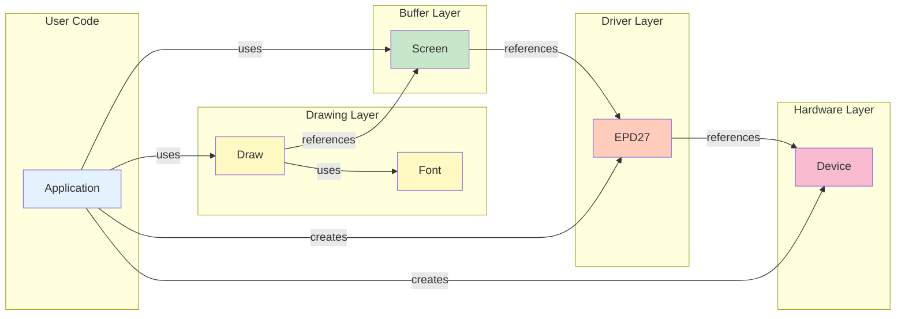
```mermaid
graph LR
    subgraph "User Code"
        U[Application]
    end

    subgraph "Drawing Layer"
        D[Draw]
        F[Font]
    end

    subgraph "Buffer Layer"
        S[Screen]
    end

    subgraph "Driver Layer"
        E[EPD27]
    end

    subgraph "Hardware Layer"
        H[Device]
    end

    U -->|uses| D
    U -->|uses| S
    U -->|creates| E
    U -->|creates| H

    D -->|references| S
    D -->|uses| F

    S -->|references| E
    E -->|references| H

    style U fill:#e3f2fd
    style D fill:#fff9c4
    style F fill:#fff9c4
    style S fill:#c8e6c9
    style E fill:#ffccbc
    style H fill:#f8bbd0
```

### Component Descriptions

#### 1. Device (Hardware Abstraction Layer)
**File**: `device.hpp`, `device.cpp`

**Purpose**: RAII wrapper for BCM2835 library, providing safe GPIO and SPI operations.

**Key Features**:
- RAII initialization and cleanup
- Type-safe pin abstraction
- SPI data transfer
- GPIO input/output operations
- Timing utilities

**Dependencies**: BCM2835 library

#### 2. Driver (Abstract Interface)
**File**: `drivers/driver.hpp`

**Purpose**: Defines the contract for all e-paper display drivers.

**Key Operations**:
- `init()`: Initialize display with mode
- `clear()`: Clear display to white
- `display()`: Send buffer and refresh
- `sleep()`: Enter low-power mode
- Query dimensions and mode

#### 3. EPD27 (Concrete Driver)
**File**: `drivers/epd27.hpp`, `drivers/epd27.cpp`

**Purpose**: Implements Driver interface for Waveshare 2.7" display (176x264 pixels).

**Key Features**:
- Hardware reset sequence
- LUT (Look-Up Table) configuration
- Black/white and 4-level grayscale modes
- Command/data transmission
- Busy state polling

**Display Modes**:
- **BlackWhite**: 1 bit per pixel
- **Grayscale4**: 2 bits per pixel (4 gray levels)

#### 4. Screen (Framebuffer Manager)
**File**: `screen.hpp`, `screen.cpp`

**Purpose**: Manages the pixel framebuffer and provides pixel-level operations.

**Key Features**:
- Automatic buffer sizing based on display mode
- Bounds-checked pixel operations
- Region clearing
- Mode-specific pixel encoding (1-bit or 2-bit)
- Buffer refresh coordination

**Buffer Layout**:
- **B/W Mode**: Packed bits (8 pixels per byte)
- **Grayscale Mode**: 4 pixels per byte (2 bits each)

#### 5. Draw (High-Level Graphics API)
**File**: `draw.hpp`, `draw.cpp`

**Purpose**: Provides high-level drawing primitives built on Screen.

**Drawing Operations**:
- Points with variable pixel sizes
- Lines (solid/dotted)
- Rectangles (filled/empty)
- Circles (filled/empty)
- Text strings
- Integers and decimals

**Drawing Styles**:
- `DotPixel`: 1x1 to 8x8 pixel sizes
- `LineStyle`: Solid or Dotted
- `DrawFill`: Empty or Full

#### 6. Font (Text Rendering)
**File**: `font.hpp`, `font.cpp`

**Purpose**: Font management and character bitmap retrieval.

**Built-in Fonts**:
- Font8 (5x8 pixels)
- Font12 (7x12 pixels)
- Font16 (11x16 pixels)
- Font20 (14x20 pixels)
- Font24 (17x24 pixels)

**Font Data**: External C arrays from Waveshare library

---

## Class Diagrams

### Core Class Structure


```mermaid
classDiagram
    class Device {
        -bool initialized_
        -bool spi_initialized_
        +init() expected~void, DeviceError~
        +is_initialized() bool
        +set_pin_output(Pin)
        +set_pin_input(Pin)
        +write_pin(Pin, bool)
        +read_pin(Pin) bool
        +spi_transfer(uint8_t) uint8_t
        +spi_write(span~byte~)
        +delay_ms(uint32_t)
        +delay_us(uint32_t)
    }

    class Pin {
        -uint8_t pin_
        +number() uint8_t
    }

    class Driver {
        <<interface>>
        +init(DisplayMode) expected~void, DriverError~*
        +clear()*
        +display(span~byte~)*
        +sleep()*
        +width() size_t*
        +height() size_t*
        +mode() DisplayMode*
        +buffer_size() size_t*
    }

    class EPD27 {
        -Device& device_
        -DisplayMode current_mode_
        -bool initialized_
        +WIDTH: size_t = 176
        +HEIGHT: size_t = 264
        +init(DisplayMode) expected~void, DriverError~
        +clear()
        +display(span~byte~)
        +sleep()
        -reset()
        -send_command(uint8_t)
        -send_data(uint8_t)
        -wait_busy()
        -set_lut_bw()
        -set_lut_grayscale()
    }

    class Screen {
        -Driver& driver_
        -vector~byte~ buffer_
        -size_t width_
        -size_t height_
        -DisplayMode mode_
        +Screen(Driver&)
        +width() size_t
        +height() size_t
        +mode() DisplayMode
        +set_pixel(size_t, size_t, Color)
        +get_pixel(size_t, size_t) Color
        +clear(Color)
        +clear_region(...)
        +refresh()
        +buffer() span~byte~
        -calculate_bw_position(...)
        -calculate_gray_position(...)
    }

    class Draw {
        -Screen& screen_
        +Draw(Screen&)
        +draw_point(...)
        +draw_line(...)
        +draw_rectangle(...)
        +draw_circle(...)
        +draw_char(...)
        +draw_string(...)
        +draw_number(...)
        +draw_decimal(...)
        -draw_horizontal_line(...)
        -draw_vertical_line(...)
    }

    class Font {
        -const uint8_t* table_
        -uint16_t width_
        -uint16_t height_
        +Font(uint8_t*, uint16_t, uint16_t)
        +metrics() FontMetrics
        +width() uint16_t
        +height() uint16_t
        +char_data(char) span~uint8_t~
        +bytes_per_char() size_t
        +font8() Font&$
        +font12() Font&$
        +font16() Font&$
        +font20() Font&$
        +font24() Font&$
    }

    Driver <|-- EPD27 : implements
    EPD27 --> Device : uses
    Screen --> Driver : references
    Draw --> Screen : references
    Draw --> Font : uses
    Device --> Pin : uses
```

### Enumeration Types

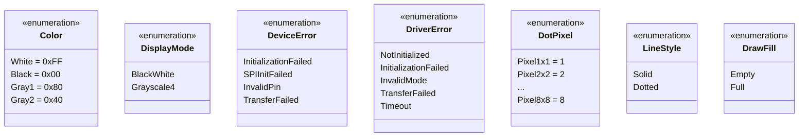
```mermaid
classDiagram
    class Color {
        <<enumeration>>
        White = 0xFF
        Black = 0x00
        Gray1 = 0x80
        Gray2 = 0x40
    }

    class DisplayMode {
        <<enumeration>>
        BlackWhite
        Grayscale4
    }

    class DeviceError {
        <<enumeration>>
        InitializationFailed
        SPIInitFailed
        InvalidPin
        TransferFailed
    }

    class DriverError {
        <<enumeration>>
        NotInitialized
        InitializationFailed
        InvalidMode
        TransferFailed
        Timeout
    }

    class DotPixel {
        <<enumeration>>
        Pixel1x1 = 1
        Pixel2x2 = 2
        ...
        Pixel8x8 = 8
    }

    class LineStyle {
        <<enumeration>>
        Solid
        Dotted
    }

    class DrawFill {
        <<enumeration>>
        Empty
        Full
    }
```

---

## Sequence Diagrams

### 1. Initialization Sequence

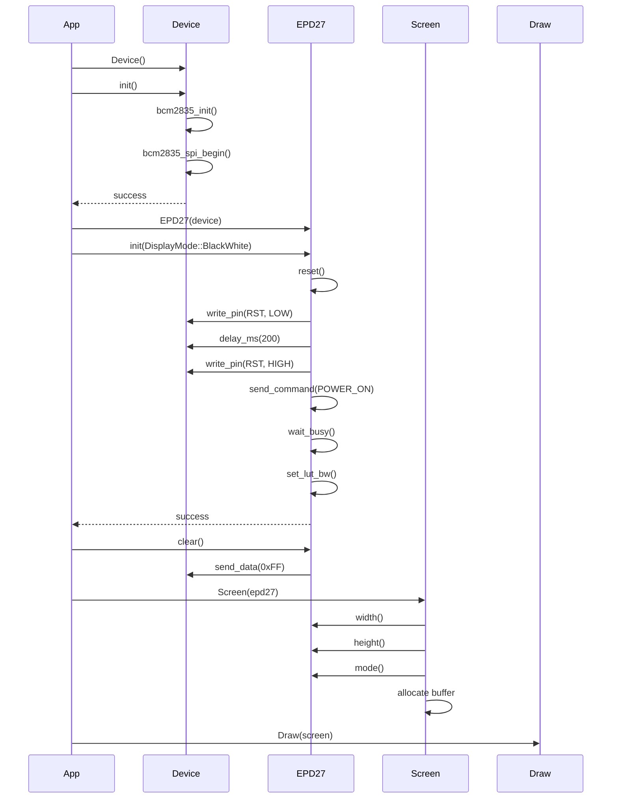
```mermaid
sequenceDiagram
    participant App
    participant Device
    participant EPD27
    participant Screen
    participant Draw

    App->>Device: Device()
    App->>Device: init()
    Device->>Device: bcm2835_init()
    Device->>Device: bcm2835_spi_begin()
    Device-->>App: success

    App->>EPD27: EPD27(device)
    App->>EPD27: init(DisplayMode::BlackWhite)
    EPD27->>EPD27: reset()
    EPD27->>Device: write_pin(RST, LOW)
    EPD27->>Device: delay_ms(200)
    EPD27->>Device: write_pin(RST, HIGH)
    EPD27->>EPD27: send_command(POWER_ON)
    EPD27->>EPD27: wait_busy()
    EPD27->>EPD27: set_lut_bw()
    EPD27-->>App: success

    App->>EPD27: clear()
    EPD27->>Device: send_data(0xFF)

    App->>Screen: Screen(epd27)
    Screen->>EPD27: width()
    Screen->>EPD27: height()
    Screen->>EPD27: mode()
    Screen->>Screen: allocate buffer

    App->>Draw: Draw(screen)
```

### 2. Drawing and Display Sequence

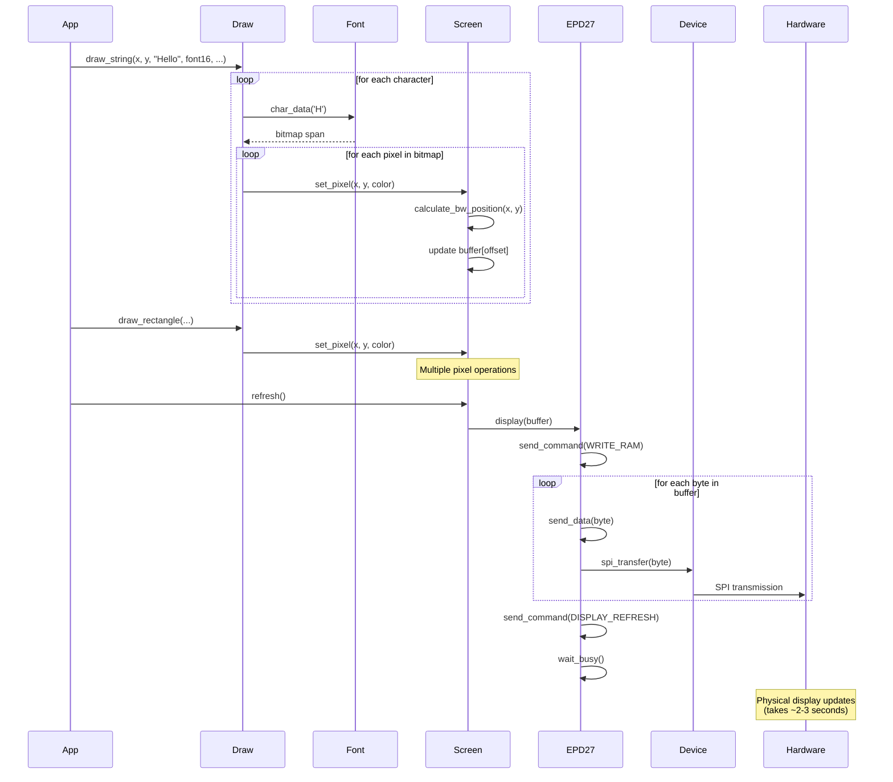
```mermaid
sequenceDiagram
    participant App
    participant Draw
    participant Font
    participant Screen
    participant EPD27
    participant Device
    participant Hardware

    App->>Draw: draw_string(x, y, "Hello", font16, ...)
    loop for each character
        Draw->>Font: char_data('H')
        Font-->>Draw: bitmap span
        loop for each pixel in bitmap
            Draw->>Screen: set_pixel(x, y, color)
            Screen->>Screen: calculate_bw_position(x, y)
            Screen->>Screen: update buffer[offset]
        end
    end

    App->>Draw: draw_rectangle(...)
    Draw->>Screen: set_pixel(x, y, color)
    Note over Screen: Multiple pixel operations

    App->>Screen: refresh()
    Screen->>EPD27: display(buffer)
    EPD27->>EPD27: send_command(WRITE_RAM)
    loop for each byte in buffer
        EPD27->>EPD27: send_data(byte)
        EPD27->>Device: spi_transfer(byte)
        Device->>Hardware: SPI transmission
    end
    EPD27->>EPD27: send_command(DISPLAY_REFRESH)
    EPD27->>EPD27: wait_busy()
    Note over Hardware: Physical display updates<br/>(takes ~2-3 seconds)
```

### 3. Mode Switching Sequence

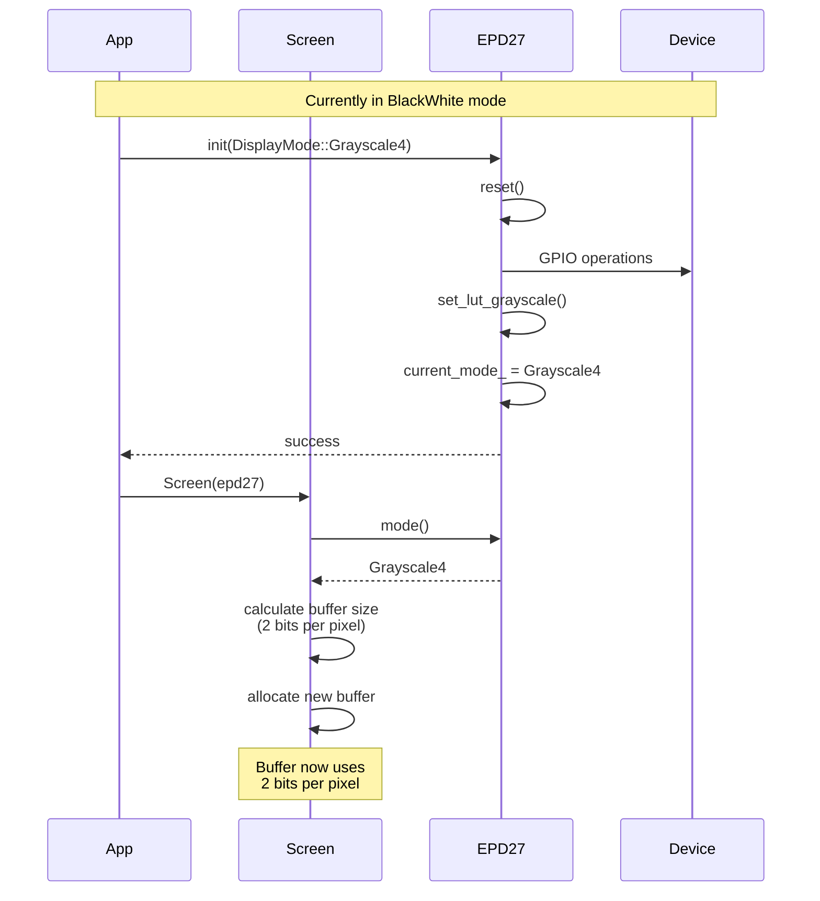
```mermaid
sequenceDiagram
    participant App
    participant Screen
    participant EPD27
    participant Device

    Note over App,Device: Currently in BlackWhite mode

    App->>EPD27: init(DisplayMode::Grayscale4)
    EPD27->>EPD27: reset()
    EPD27->>Device: GPIO operations
    EPD27->>EPD27: set_lut_grayscale()
    EPD27->>EPD27: current_mode_ = Grayscale4
    EPD27-->>App: success

    App->>Screen: Screen(epd27)
    Screen->>EPD27: mode()
    EPD27-->>Screen: Grayscale4
    Screen->>Screen: calculate buffer size<br/>(2 bits per pixel)
    Screen->>Screen: allocate new buffer

    Note over Screen: Buffer now uses<br/>2 bits per pixel
```

### 4. Error Handling Sequence

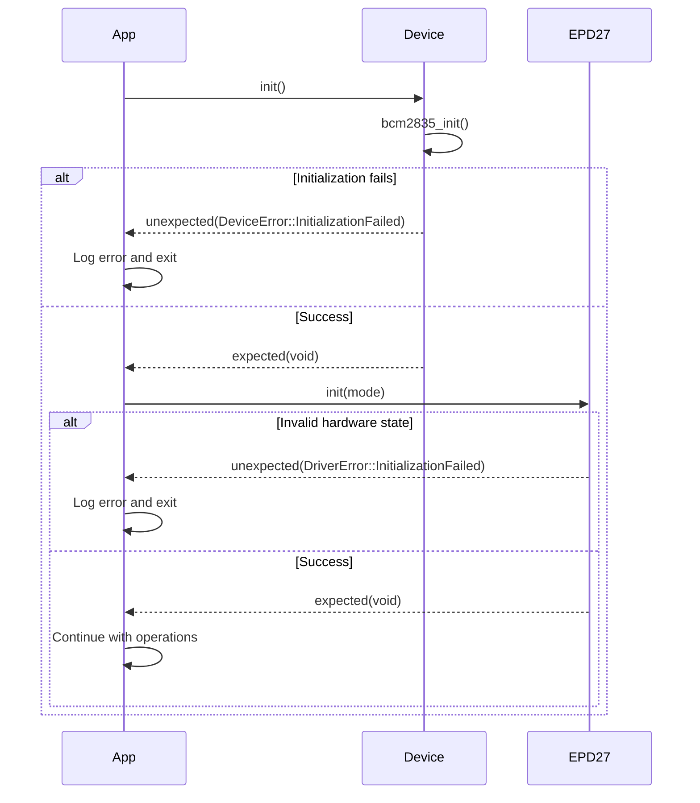
```mermaid
sequenceDiagram
    participant App
    participant Device
    participant EPD27

    App->>Device: init()
    Device->>Device: bcm2835_init()
    alt Initialization fails
        Device-->>App: unexpected(DeviceError::InitializationFailed)
        App->>App: Log error and exit
    else Success
        Device-->>App: expected(void)
        App->>EPD27: init(mode)
        alt Invalid hardware state
            EPD27-->>App: unexpected(DriverError::InitializationFailed)
            App->>App: Log error and exit
        else Success
            EPD27-->>App: expected(void)
            App->>App: Continue with operations
        end
    end
```

---

## Data Flow

### Pixel Data Flow (Writing to Display)

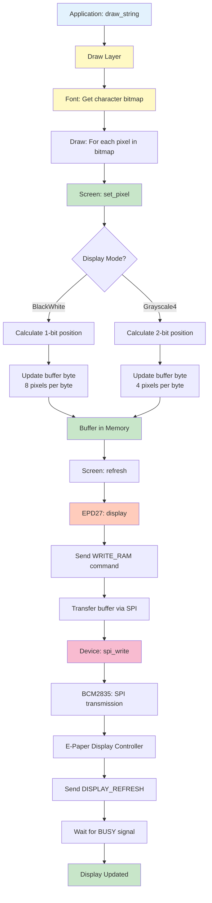
```mermaid
flowchart TD
    A[Application: draw_string] --> B[Draw Layer]
    B --> C[Font: Get character bitmap]
    C --> D[Draw: For each pixel in bitmap]
    D --> E[Screen: set_pixel]
    E --> F{Display Mode?}

    F -->|BlackWhite| G[Calculate 1-bit position]
    F -->|Grayscale4| H[Calculate 2-bit position]

    G --> I[Update buffer byte<br/>8 pixels per byte]
    H --> J[Update buffer byte<br/>4 pixels per byte]

    I --> K[Buffer in Memory]
    J --> K

    K --> L[Screen: refresh]
    L --> M[EPD27: display]
    M --> N[Send WRITE_RAM command]
    N --> O[Transfer buffer via SPI]
    O --> P[Device: spi_write]
    P --> Q[BCM2835: SPI transmission]
    Q --> R[E-Paper Display Controller]
    R --> S[Send DISPLAY_REFRESH]
    S --> T[Wait for BUSY signal]
    T --> U[Display Updated]

    style A fill:#e3f2fd
    style B fill:#fff9c4
    style C fill:#fff9c4
    style E fill:#c8e6c9
    style K fill:#c8e6c9
    style M fill:#ffccbc
    style P fill:#f8bbd0
    style U fill:#c8e6c9
```

### Memory Layout in Buffer

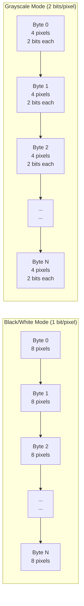
```mermaid
graph LR
    subgraph "Black/White Mode (1 bit/pixel)"
        BW1["Byte 0<br/>8 pixels"]
        BW2["Byte 1<br/>8 pixels"]
        BW3["Byte 2<br/>8 pixels"]
        BW4["...<br/>..."]
        BW5["Byte N<br/>8 pixels"]
    end

    subgraph "Grayscale Mode (2 bits/pixel)"
        GS1["Byte 0<br/>4 pixels<br/>2 bits each"]
        GS2["Byte 1<br/>4 pixels<br/>2 bits each"]
        GS3["Byte 2<br/>4 pixels<br/>2 bits each"]
        GS4["...<br/>..."]
        GS5["Byte N<br/>4 pixels<br/>2 bits each"]
    end

    BW1 --> BW2 --> BW3 --> BW4 --> BW5
    GS1 --> GS2 --> GS3 --> GS4 --> GS5
```

**Buffer Size Calculation**:
- **Black/White**: `(width * height) / 8` bytes
  - 176 × 264 = 46,464 pixels
  - 46,464 / 8 = 5,808 bytes
- **Grayscale4**: `(width * height) / 4` bytes
  - 176 × 264 = 46,464 pixels
  - 46,464 / 4 = 11,616 bytes

---

## Error Handling

### Error Propagation Architecture

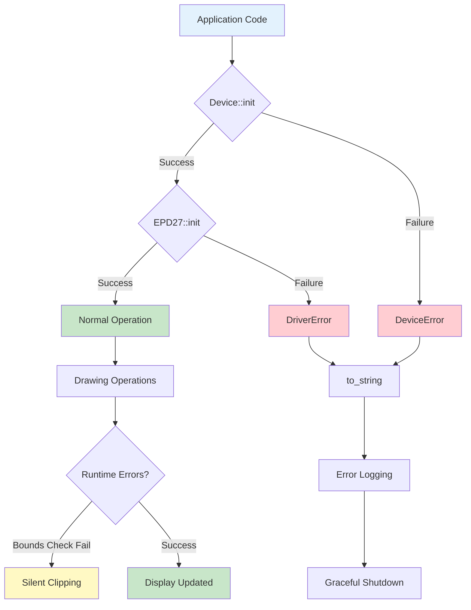
```mermaid
flowchart TD
    A[Application Code] --> B{Device::init}
    B -->|Success| C{EPD27::init}
    B -->|Failure| E1[DeviceError]

    C -->|Success| D[Normal Operation]
    C -->|Failure| E2[DriverError]

    E1 --> F[to_string]
    E2 --> F

    F --> G[Error Logging]
    G --> H[Graceful Shutdown]

    D --> I[Drawing Operations]
    I --> J{Runtime Errors?}
    J -->|Bounds Check Fail| K[Silent Clipping]
    J -->|Success| L[Display Updated]

    style A fill:#e3f2fd
    style D fill:#c8e6c9
    style L fill:#c8e6c9
    style E1 fill:#ffcdd2
    style E2 fill:#ffcdd2
    style K fill:#fff9c4
```

### Error Types and Handling

| Error Type | Category | Handling Strategy |
|------------|----------|-------------------|
| `DeviceError::InitializationFailed` | Hardware | Return `std::expected`, log and exit |
| `DeviceError::SPIInitFailed` | Hardware | Return `std::expected`, log and exit |
| `DriverError::InitializationFailed` | Driver | Return `std::expected`, log and exit |
| `DriverError::Timeout` | Driver | Return `std::expected`, retry or exit |
| Out-of-bounds pixel | Logic | Silent clipping (no exception) |

### Error Handling Pattern

```cpp
// Modern C++ error handling with std::expected
auto result = device.init();
if (!result) {
    std::cerr << "Error: " << to_string(result.error()) << "\n";
    return EXIT_FAILURE;
}

// Continue with operations
auto display_result = epd27.init(DisplayMode::BlackWhite);
if (!display_result) {
    std::cerr << "Display error: " << to_string(display_result.error()) << "\n";
    return EXIT_FAILURE;
}
```

---

## Design Patterns

### 1. RAII (Resource Acquisition Is Initialization)

**Applied in**: `Device`, `Screen`


```mermaid
flowchart LR
    A[Constructor] -->|Acquire| B[BCM2835 Init]
    B --> C[Configure SPI]
    C --> D[Setup GPIO]
    D --> E[Resource Ready]
    E --> F[Use Resource]
    F --> G[Destructor]
    G -->|Release| H[BCM2835 Close]
    H --> I[SPI End]
    I --> J[Resource Freed]

    style A fill:#c8e6c9
    style E fill:#c8e6c9
    style G fill:#ffccbc
    style J fill:#cfd8dc
```

**Benefits**:
- Automatic cleanup
- Exception-safe
- No manual memory management
- Prevents resource leaks

### 2. Strategy Pattern

**Applied in**: Display modes (BlackWhite vs Grayscale4)

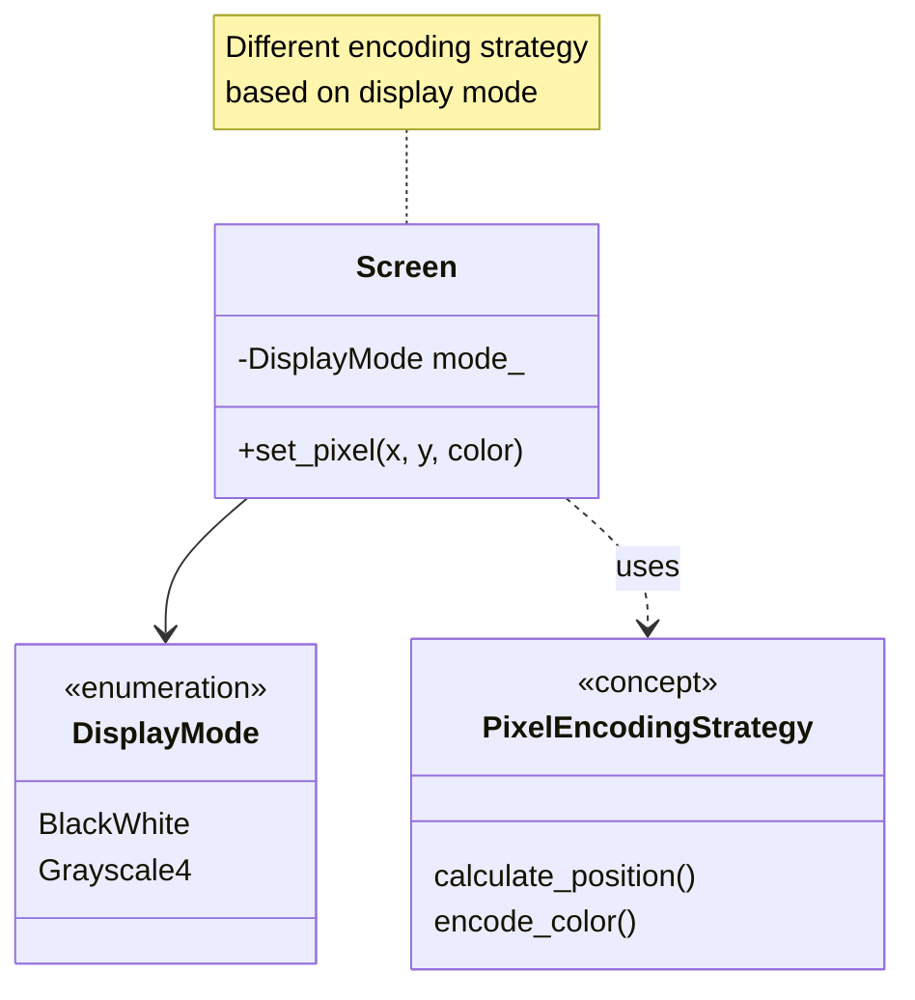
```mermaid
classDiagram
    class Screen {
        -DisplayMode mode_
        +set_pixel(x, y, color)
    }

    class DisplayMode {
        <<enumeration>>
        BlackWhite
        Grayscale4
    }

    class PixelEncodingStrategy {
        <<concept>>
        calculate_position()
        encode_color()
    }

    Screen --> DisplayMode
    Screen ..> PixelEncodingStrategy : uses

    note for Screen "Different encoding strategy<br/>based on display mode"
```

### 3. Facade Pattern

**Applied in**: `Draw` class

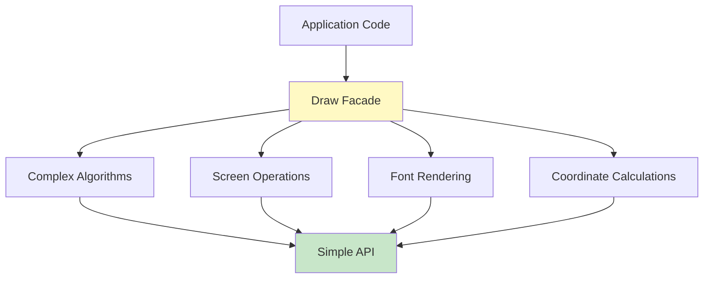
```mermaid
graph TD
    A[Application Code] --> B[Draw Facade]
    B --> C[Complex Algorithms]
    B --> D[Screen Operations]
    B --> E[Font Rendering]
    B --> F[Coordinate Calculations]

    C --> G[Simple API]
    D --> G
    E --> G
    F --> G

    style B fill:#fff9c4
    style G fill:#c8e6c9
```

**Benefits**:
- Simplified interface for complex operations
- Hides implementation details
- Easier to use and maintain

### 4. Dependency Injection

**Applied in**: All component relationships

```cpp
// Constructor injection
Screen(Driver& driver);        // Screen depends on Driver
Draw(Screen& screen);          // Draw depends on Screen
EPD27(Device& device);         // EPD27 depends on Device
```

**Benefits**:
- Loose coupling
- Testability
- Flexibility (can swap implementations)

### 5. Interface Segregation

**Applied in**: `Driver` abstract interface

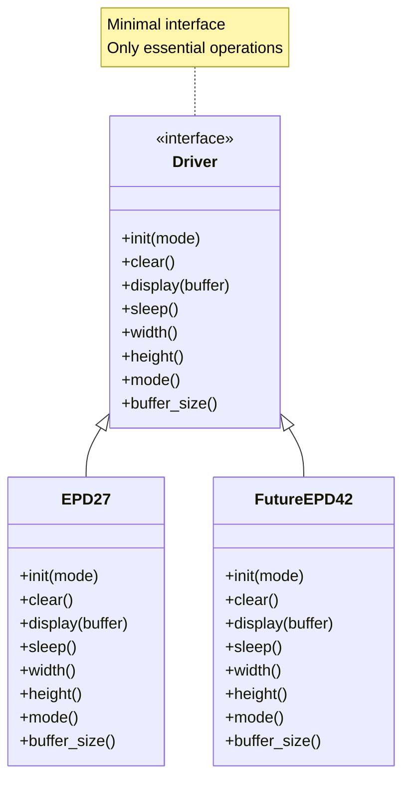
```mermaid
classDiagram
    class Driver {
        <<interface>>
        +init(mode)
        +clear()
        +display(buffer)
        +sleep()
        +width()
        +height()
        +mode()
        +buffer_size()
    }

    class EPD27 {
        +init(mode)
        +clear()
        +display(buffer)
        +sleep()
        +width()
        +height()
        +mode()
        +buffer_size()
    }

    class FutureEPD42 {
        +init(mode)
        +clear()
        +display(buffer)
        +sleep()
        +width()
        +height()
        +mode()
        +buffer_size()
    }

    Driver <|-- EPD27
    Driver <|-- FutureEPD42

    note for Driver "Minimal interface<br/>Only essential operations"
```

---

## Hardware Abstraction

### GPIO Pin Configuration

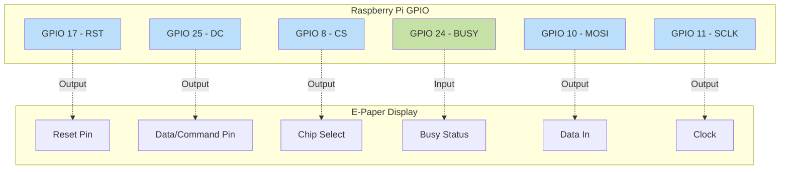
```mermaid
graph TB
    subgraph "Raspberry Pi GPIO"
        GPIO17[GPIO 17 - RST]
        GPIO25[GPIO 25 - DC]
        GPIO8[GPIO 8 - CS]
        GPIO24[GPIO 24 - BUSY]
        GPIO10[GPIO 10 - MOSI]
        GPIO11[GPIO 11 - SCLK]
    end

    subgraph "E-Paper Display"
        RST[Reset Pin]
        DC[Data/Command Pin]
        CS[Chip Select]
        BUSY[Busy Status]
        DIN[Data In]
        CLK[Clock]
    end

    GPIO17 -.->|Output| RST
    GPIO25 -.->|Output| DC
    GPIO8 -.->|Output| CS
    GPIO24 -.->|Input| BUSY
    GPIO10 -.->|Output| DIN
    GPIO11 -.->|Output| CLK

    style GPIO17 fill:#bbdefb
    style GPIO25 fill:#bbdefb
    style GPIO8 fill:#bbdefb
    style GPIO24 fill:#c5e1a5
    style GPIO10 fill:#bbdefb
    style GPIO11 fill:#bbdefb
```

### SPI Communication Protocol

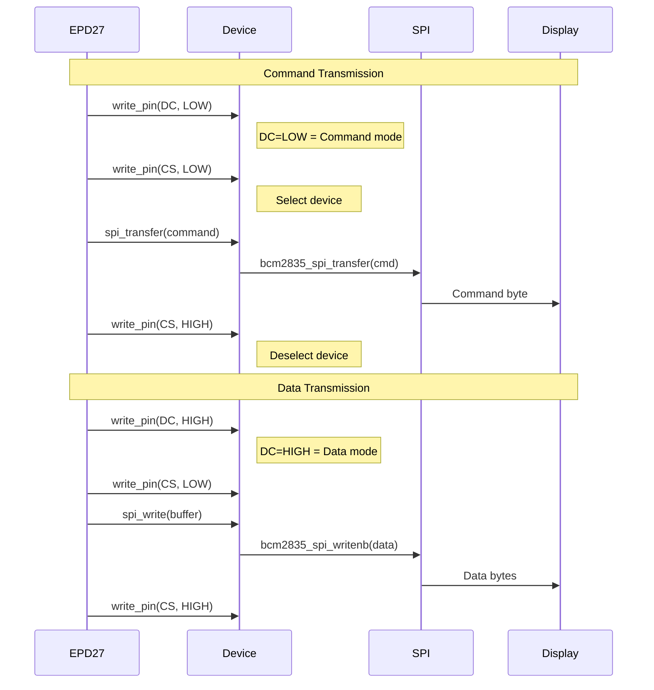
```mermaid
sequenceDiagram
    participant EPD27
    participant Device
    participant SPI
    participant Display

    Note over EPD27,Display: Command Transmission
    EPD27->>Device: write_pin(DC, LOW)
    Note right of Device: DC=LOW = Command mode
    EPD27->>Device: write_pin(CS, LOW)
    Note right of Device: Select device
    EPD27->>Device: spi_transfer(command)
    Device->>SPI: bcm2835_spi_transfer(cmd)
    SPI->>Display: Command byte
    EPD27->>Device: write_pin(CS, HIGH)
    Note right of Device: Deselect device

    Note over EPD27,Display: Data Transmission
    EPD27->>Device: write_pin(DC, HIGH)
    Note right of Device: DC=HIGH = Data mode
    EPD27->>Device: write_pin(CS, LOW)
    EPD27->>Device: spi_write(buffer)
    Device->>SPI: bcm2835_spi_writenb(data)
    SPI->>Display: Data bytes
    EPD27->>Device: write_pin(CS, HIGH)
```

### Hardware State Machine

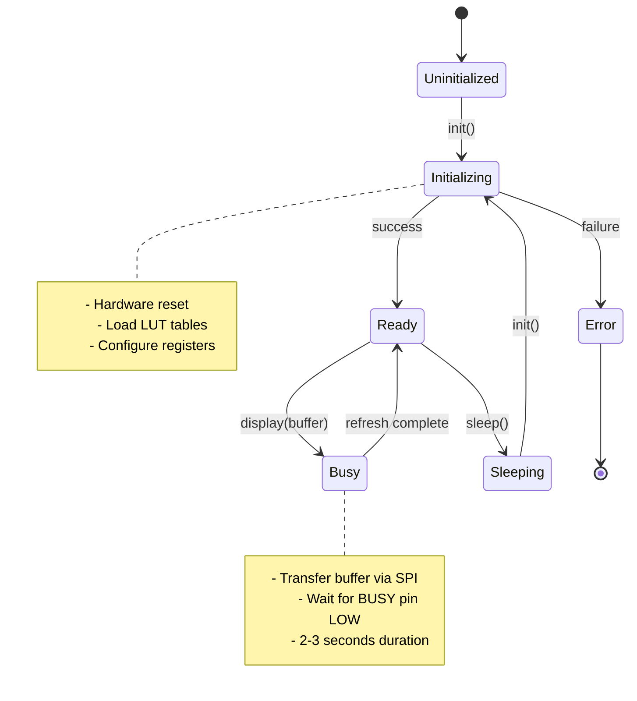
```mermaid
stateDiagram-v2
    [*] --> Uninitialized
    Uninitialized --> Initializing : init()
    Initializing --> Ready : success
    Initializing --> Error : failure

    Ready --> Busy : display(buffer)
    Busy --> Ready : refresh complete

    Ready --> Sleeping : sleep()
    Sleeping --> Initializing : init()

    Error --> [*]

    note right of Initializing
        - Hardware reset
        - Load LUT tables
        - Configure registers
    end note

    note right of Busy
        - Transfer buffer via SPI
        - Wait for BUSY pin LOW
        - 2-3 seconds duration
    end note
```

---

## Performance Considerations

### Memory Usage

| Component | Memory | Description |
|-----------|--------|-------------|
| **Device** | ~8 bytes | State flags |
| **EPD27** | ~24 bytes | Mode, flags, reference |
| **Screen** | 5.8-11.6 KB | Framebuffer (mode-dependent) |
| **Draw** | 8 bytes | Screen reference |
| **Font** | 16 bytes | Pointer + dimensions |

**Total**: ~6-12 KB (mostly framebuffer)

### Timing Characteristics

| Operation | Duration | Notes |
|-----------|----------|-------|
| **init()** | ~500ms | Hardware reset + LUT loading |
| **clear()** | 2-3s | Full display refresh |
| **display()** | 2-3s | Data transfer + refresh |
| **set_pixel()** | <1μs | Memory write only |
| **draw_string()** | <1ms | Multiple set_pixel calls |

### Optimization Strategies

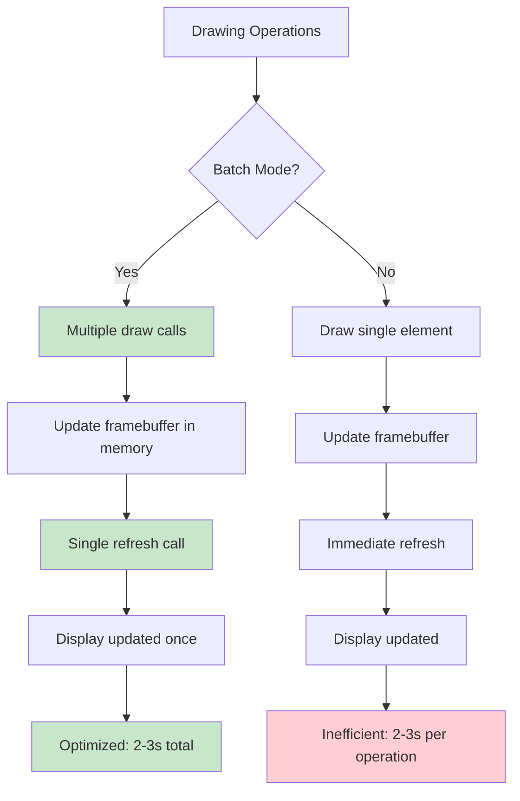
```mermaid
flowchart TD
    A[Drawing Operations] --> B{Batch Mode?}
    B -->|Yes| C[Multiple draw calls]
    C --> D[Update framebuffer in memory]
    D --> E[Single refresh call]
    E --> F[Display updated once]

    B -->|No| G[Draw single element]
    G --> H[Update framebuffer]
    H --> I[Immediate refresh]
    I --> J[Display updated]

    F --> K[Optimized: 2-3s total]
    J --> L[Inefficient: 2-3s per operation]

    style C fill:#c8e6c9
    style E fill:#c8e6c9
    style K fill:#c8e6c9
    style L fill:#ffcdd2
```

**Best Practice**: Batch all drawing operations, then call `refresh()` once.

---

## Extension Points

### Adding New Display Drivers

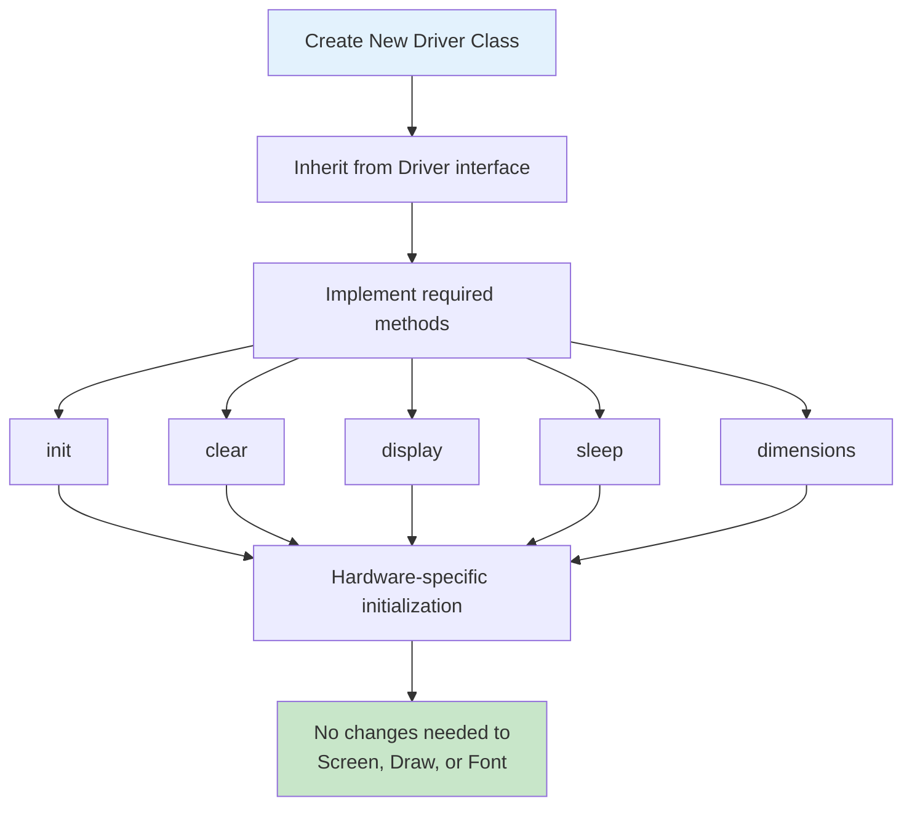
```mermaid
flowchart TD
    A[Create New Driver Class] --> B[Inherit from Driver interface]
    B --> C[Implement required methods]
    C --> D1[init]
    C --> D2[clear]
    C --> D3[display]
    C --> D4[sleep]
    C --> D5[dimensions]

    D1 --> E[Hardware-specific initialization]
    D2 --> E
    D3 --> E
    D4 --> E
    D5 --> E

    E --> F[No changes needed to<br/>Screen, Draw, or Font]

    style A fill:#e3f2fd
    style F fill:#c8e6c9
```

**Example**: Adding EPD42 (4.2" display)

```cpp
class EPD42 : public Driver {
public:
    static constexpr std::size_t WIDTH = 400;
    static constexpr std::size_t HEIGHT = 300;

    explicit EPD42(Device& device);

    auto init(DisplayMode mode) -> std::expected<void, DriverError> override;
    auto clear() -> void override;
    auto display(std::span<const std::byte> buffer) -> void override;
    auto sleep() -> void override;

    // ... implement interface
};
```

### Adding New Drawing Primitives

```mermaid
flowchart LR
    A[New Primitive<br/>e.g., draw_polygon] --> B[Add to Draw class]
    B --> C[Implement using<br/>existing primitives]
    C --> D1[draw_line]
    C --> D2[draw_point]
    C --> D3[set_pixel]

    D1 --> E[Uses Screen API]
    D2 --> E
    D3 --> E

    style A fill:#fff9c4
    style E fill:#c8e6c9
```

### Adding New Font Sizes

```cpp
// In font.cpp
extern "C" {
    extern const unsigned char Font32[];
}

auto Font::font32() -> const Font& {
    static const Font font32_instance{Font32, 24, 32};
    return font32_instance;
}
```

---

## Testing Architecture

### Unit Testing Structure

```mermaid
graph TB
    subgraph "Test Suite"
        T1[Device Tests<br/>Mock BCM2835]
        T2[Screen Tests<br/>Mock Driver]
        T3[Draw Tests<br/>Mock Screen]
        T4[Font Tests<br/>Real Data]
    end

    subgraph "Production Code"
        P1[Device]
        P2[Screen]
        P3[Draw]
        P4[Font]
    end

    T1 -.->|tests| P1
    T2 -.->|tests| P2
    T3 -.->|tests| P3
    T4 -.->|tests| P4

    style T1 fill:#e1bee7
    style T2 fill:#e1bee7
    style T3 fill:#e1bee7
    style T4 fill:#e1bee7
```

### Integration Testing Flow

```mermaid
sequenceDiagram
    participant Test
    participant Device
    participant EPD27
    participant Screen
    participant Draw

    Test->>Device: Mock initialization
    Test->>EPD27: Create with mock device
    Test->>Screen: Create with EPD27
    Test->>Draw: Create with Screen

    Test->>Draw: draw_string(...)
    Draw->>Screen: Multiple set_pixel calls

    Test->>Screen: Verify buffer contents
    Test->>Test: Assert expectations
```

---

## Conclusion

This architecture provides a clean, maintainable, and extensible foundation for e-paper display control. The layered design ensures:

- **Separation of Concerns**: Each component has a single responsibility
- **Testability**: Dependencies are injected, interfaces are well-defined
- **Extensibility**: New displays or drawing primitives can be added easily
- **Type Safety**: Modern C++ features prevent common errors
- **Performance**: Zero-cost abstractions with efficient memory usage
- **Maintainability**: Clear structure and consistent patterns

The architecture follows modern C++ best practices while remaining simple and practical for embedded systems programming.

