# E-Paper Library - Quick Reference Guide

## Component Dependency Graph

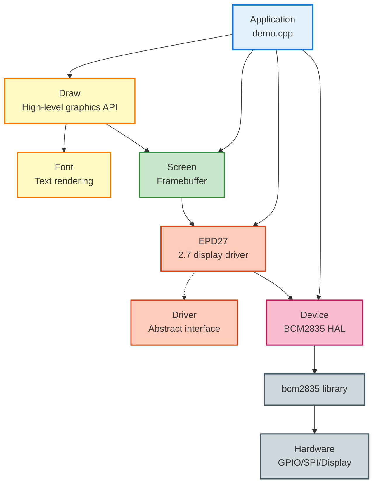

---

## Typical Usage Flow

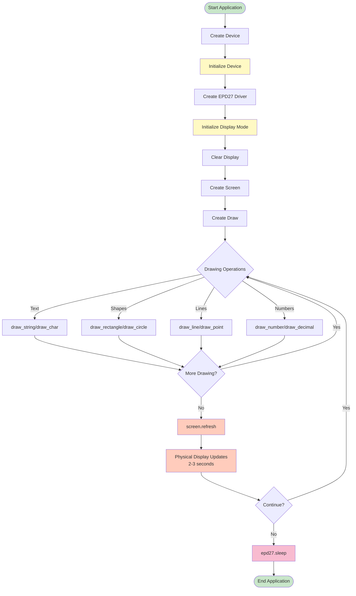

---

## Display Modes Comparison

```mermaid
graph TB
    subgraph "Black & White Mode"
        BW_Header[DisplayMode::BlackWhite]
        BW_Bits[1 bit per pixel]
        BW_Colors[2 colors]
        BW_Size[5,808 bytes buffer]
        BW_Fast[Faster refresh]

        BW_Header --> BW_Bits
        BW_Bits --> BW_Colors
        BW_Colors --> BW_Size
        BW_Size --> BW_Fast
    end

    subgraph "4-Level Grayscale Mode"
        GS_Header[DisplayMode::Grayscale4]
        GS_Bits[2 bits per pixel]
        GS_Colors[4 gray levels]
        GS_Size[11,616 bytes buffer]
        GS_Quality[Better quality]

        GS_Header --> GS_Bits
        GS_Bits --> GS_Colors
        GS_Colors --> GS_Size
        GS_Size --> GS_Quality
    end

    style BW_Header fill:#ffffff,stroke:#000000,stroke-width:3px
    style GS_Header fill:#cccccc,stroke:#000000,stroke-width:3px
```

### Color Values by Mode

| Color | B/W Value | Grayscale Value | Visual |
|-------|-----------|-----------------|--------|
| `Color::White` | 0xFF | 0xFF | ⬜ Lightest |
| `Color::Gray1` | N/A | 0x80 | ◻️ Light gray |
| `Color::Gray2` | N/A | 0x40 | ◽ Dark gray |
| `Color::Black` | 0x00 | 0x00 | ⬛ Darkest |

---

## API Cheat Sheet

### Initialization Pattern

```cpp
// 1. Hardware layer
Device device;
device.init().value();  // or handle error

// 2. Driver layer
EPD27 epd27(device);
epd27.init(DisplayMode::BlackWhite).value();
epd27.clear();

// 3. Application layers
Screen screen(epd27);
Draw draw(screen);
```

### Drawing Operations

```cpp
// Points
draw.draw_point(x, y, Color::Black, DotPixel::Pixel2x2);

// Lines
draw.draw_line(x1, y1, x2, y2, Color::Black,
    DotPixel::Pixel1x1, LineStyle::Solid);

// Rectangles
draw.draw_rectangle(x1, y1, x2, y2, Color::Black,
    DotPixel::Pixel1x1, DrawFill::Full);

// Circles
draw.draw_circle(cx, cy, radius, Color::Black,
    DotPixel::Pixel1x1, DrawFill::Empty);

// Text
draw.draw_string(x, y, "Hello", Font::font16(),
    Color::Black, Color::White);

// Numbers
draw.draw_number(x, y, 42, Font::font12(),
    Color::Black, Color::White);

// Decimals
draw.draw_decimal(x, y, 3.14, 2, Font::font12(),
    Color::Black, Color::White);
```

### Screen Operations

```cpp
// Direct pixel access
screen.set_pixel(x, y, Color::Black);
Color c = screen.get_pixel(x, y);

// Clearing
screen.clear(Color::White);
screen.clear_region(x1, y1, x2, y2, Color::White);

// Update display
screen.refresh();  // Sends buffer to hardware
```

---

## Memory Layout Visualization

### Black & White Buffer (176x264 = 5,808 bytes)

```
Pixel Layout (left to right):
┌─────┬─────┬─────┬─────┬─────┬─────┬─────┬─────┐
│ P0  │ P1  │ P2  │ P3  │ P4  │ P5  │ P6  │ P7  │  = 1 byte
└─────┴─────┴─────┴─────┴─────┴─────┴─────┴─────┘
  bit7  bit6  bit5  bit4  bit3  bit2  bit1  bit0

Each bit: 0 = Black, 1 = White
```

### Grayscale Buffer (176x264 = 11,616 bytes)

```
Pixel Layout (left to right):
┌─────────┬─────────┬─────────┬─────────┐
│   P0    │   P1    │   P2    │   P3    │  = 1 byte
│ 2 bits  │ 2 bits  │ 2 bits  │ 2 bits  │
└─────────┴─────────┴─────────┴─────────┘
  bit7-6    bit5-4    bit3-2    bit1-0

2-bit values: 00=Black, 01=Gray2, 10=Gray1, 11=White
```

---

## Hardware Wiring Diagram

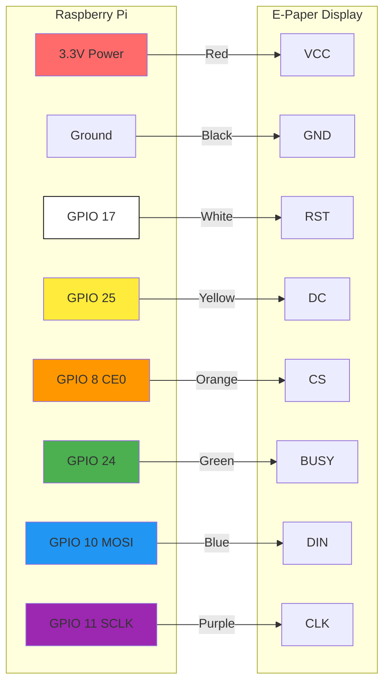

### Pin Function Summary

| Pin | Type | Function |
|-----|------|----------|
| **VCC** | Power | 3.3V supply |
| **GND** | Power | Ground reference |
| **RST** | Output | Hardware reset (active LOW) |
| **DC** | Output | Data/Command select (LOW=cmd, HIGH=data) |
| **CS** | Output | SPI chip select (active LOW) |
| **BUSY** | Input | Display busy status (HIGH=busy) |
| **DIN** | Output | SPI data (MOSI) |
| **CLK** | Output | SPI clock |

---

## Error Handling Quick Reference

### Error Types

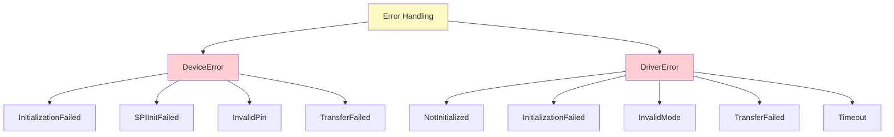

### Error Handling Pattern

```cpp
// Using std::expected (C++23)
if (auto result = device.init(); !result) {
    std::cerr << "Error: " << to_string(result.error()) << "\n";
    return EXIT_FAILURE;
}

// Alternative: value() throws if error
device.init().value();  // throws std::bad_expected_access
```

---

## Performance Tips

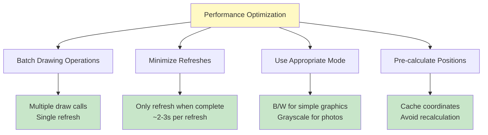

### Timing Measurements

```mermaid
gantt
    title E-Paper Display Operation Timeline
    dateFormat X
    axisFormat %Ls

    section Init
    Hardware Reset    :0, 200
    LUT Configuration :200, 300

    section Drawing
    draw_string (10 chars) :500, 1
    draw_rectangle  :501, 1
    draw_circle     :502, 1
    Multiple operations :503, 5

    section Display
    SPI Transfer (5KB) :600, 400
    Display Refresh    :1000, 2000
```

**Key Takeaways**:
- Drawing operations: microseconds to milliseconds
- Display refresh: 2-3 seconds (hardware limitation)
- **Strategy**: Batch all drawing, then refresh once

---

## Font Size Reference

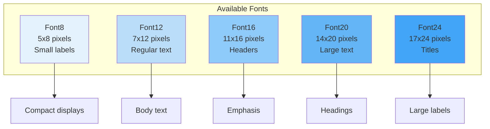

### Font Usage

```cpp
// Access built-in fonts
const Font& f8  = Font::font8();   // Smallest
const Font& f12 = Font::font12();  // Default
const Font& f16 = Font::font16();  // Medium
const Font& f20 = Font::font20();  // Large
const Font& f24 = Font::font24();  // Largest

// Query font metrics
auto width  = f16.width();   // Character width
auto height = f16.height();  // Character height
```

---

## Common Patterns

### Pattern 1: Full Screen Update

```cpp
void update_display(Screen& screen, Draw& draw) {
    // Clear to white
    screen.clear(Color::White);

    // Draw all content
    draw.draw_string(10, 10, "Title", Font::font24(),
        Color::Black, Color::White);
    draw.draw_rectangle(10, 40, 166, 42, Color::Black);
    draw.draw_string(10, 50, "Content", Font::font16(),
        Color::Black, Color::White);

    // Single refresh at end
    screen.refresh();
}
```

### Pattern 2: Partial Region Update

```cpp
void update_region(Screen& screen, Draw& draw,
                   int x, int y, int w, int h) {
    // Clear region
    screen.clear_region(x, y, x+w, y+h, Color::White);

    // Draw in region
    draw.draw_string(x, y, "Updated", Font::font12(),
        Color::Black, Color::White);

    // Refresh (updates entire display)
    screen.refresh();
}
```

### Pattern 3: Mode Switching

```cpp
void switch_mode(EPD27& epd27, DisplayMode new_mode) {
    // Re-initialize with new mode
    epd27.init(new_mode).value();

    // Create new screen (buffer resized automatically)
    Screen screen(epd27);
    Draw draw(screen);

    // Continue with drawing operations
    // ...
}
```

### Pattern 4: Error-Safe Initialization

```cpp
auto safe_init() -> std::expected<std::tuple<Device, EPD27, Screen, Draw>, std::string> {
    Device device;

    if (auto result = device.init(); !result) {
        return std::unexpected(std::string(to_string(result.error())));
    }

    EPD27 epd27(device);

    if (auto result = epd27.init(DisplayMode::BlackWhite); !result) {
        return std::unexpected(std::string(to_string(result.error())));
    }

    epd27.clear();

    Screen screen(epd27);
    Draw draw(screen);

    return std::make_tuple(
        std::move(device),
        std::move(epd27),
        std::move(screen),
        std::move(draw)
    );
}
```

---

## Display States

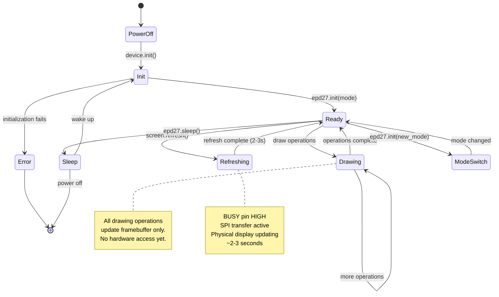

---

## Troubleshooting Guide

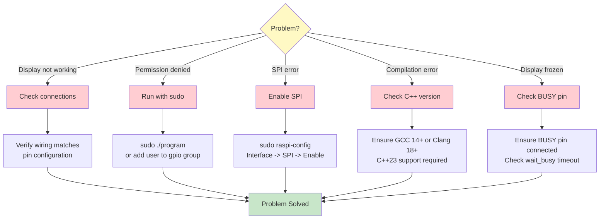

---

## Build System Overview

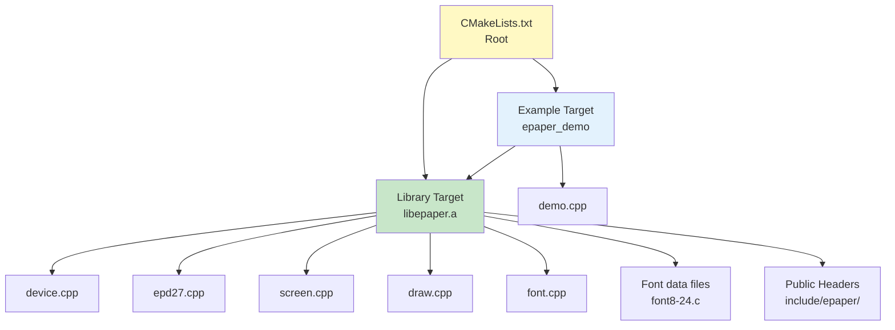

### Build Commands

```bash
# Configure
cmake -B build -DCMAKE_CXX_COMPILER=g++-14

# Build library
cmake --build build --target epaper

# Build demo
cmake --build build --target epaper_demo

# Build everything
cmake --build build -j$(nproc)

# Run demo
sudo ./build/examples/epaper_demo
```

---

## Key Concepts Summary

### Dependency Injection
Every component receives its dependencies through constructor parameters, enabling loose coupling and testability.

### RAII Pattern
Resources are acquired in constructors and released in destructors automatically, preventing leaks.

### std::expected
Modern error handling without exceptions, providing explicit success/failure paths.

### Type Safety
Enums and type-safe wrappers (like `Pin`) prevent misuse and improve code clarity.

### Zero-Cost Abstractions
High-level interfaces compile down to efficient machine code with no runtime overhead.

---

## Quick Links

- **Full Architecture**: See `ARCHITECTURE.md` for detailed diagrams and explanations
- **User Guide**: See `README.md` for usage examples and installation
- **API Reference**: See header files in `include/epaper/`
- **Examples**: See `examples/demo.cpp` for working code

---

*This quick reference is designed for fast lookup during development. Refer to the full architecture documentation for in-depth explanations.*

