# E-Paper Display Library - Visual Architecture Summary

> A high-level visual overview of the entire system architecture

---

## 🏗️ System Architecture at a Glance

### The Big Picture

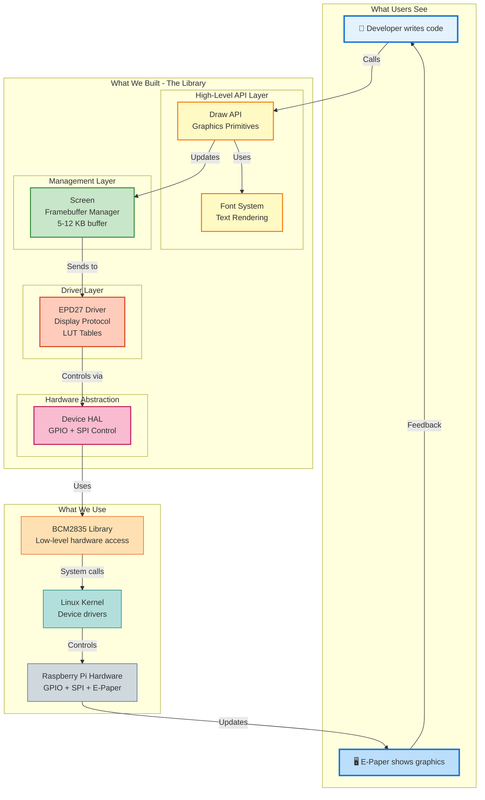

---

## 🎨 Design Philosophy

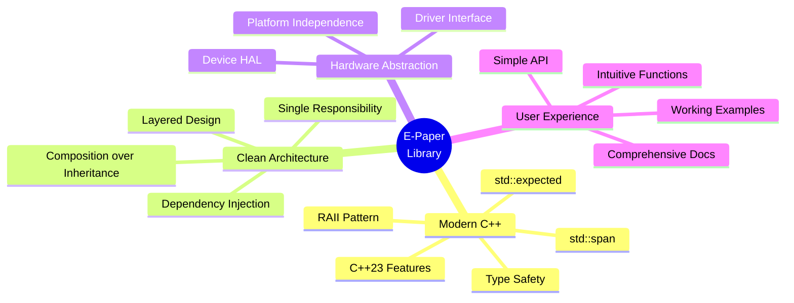

---

## 📊 Component Relationships

### Object Ownership and References

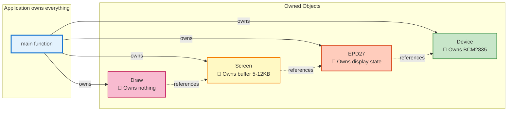

**Key Insight**: Clear ownership prevents memory leaks. References enable loose coupling.

---

## 🔄 How Drawing Works

### From Code to Display

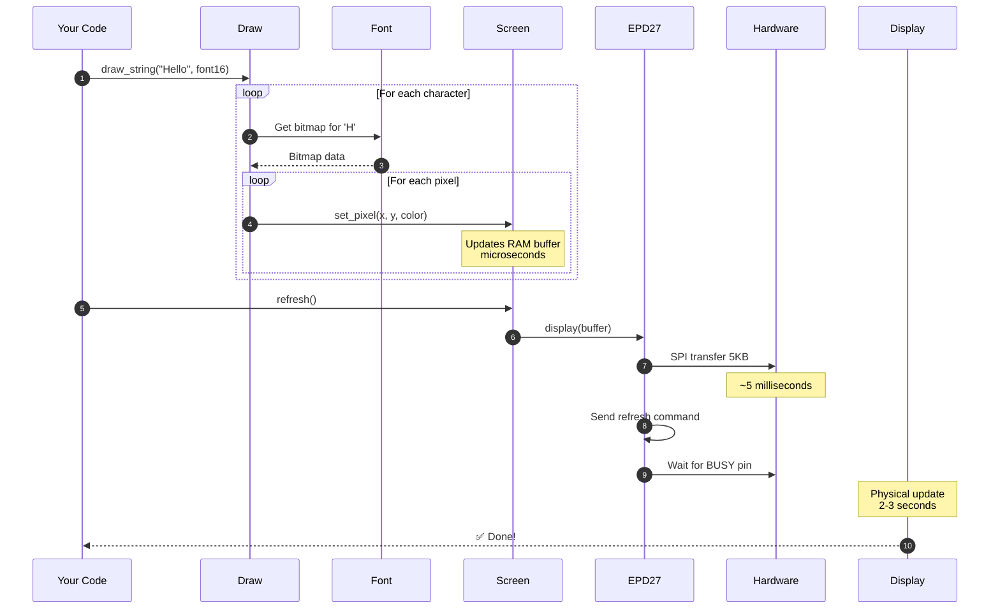

**Timeline**:
- Drawing operations: < 1ms (in RAM)
- SPI transfer: ~5ms
- Display refresh: **2-3 seconds** ⏱️ (hardware limitation)

---

## 🧩 Layer Architecture

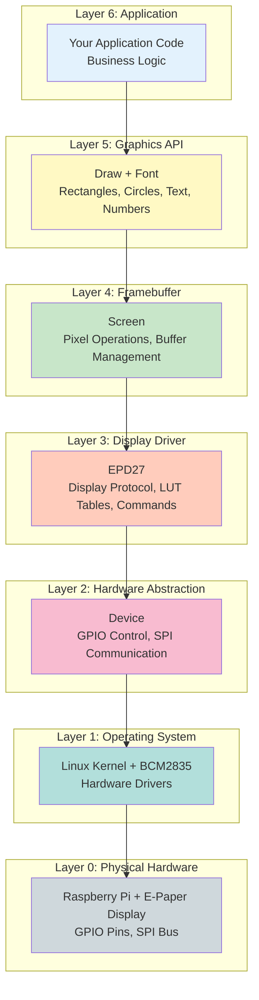

**Abstraction Benefits**:
- ✅ Each layer only knows about the layer below
- ✅ Easy to test (mock lower layers)
- ✅ Easy to extend (add new displays)
- ✅ Clear responsibilities

---

## 🎯 Key Design Patterns

### 1. RAII (Resource Acquisition Is Initialization)

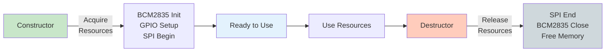

**Benefit**: No manual cleanup needed. No memory leaks.

### 2. Dependency Injection

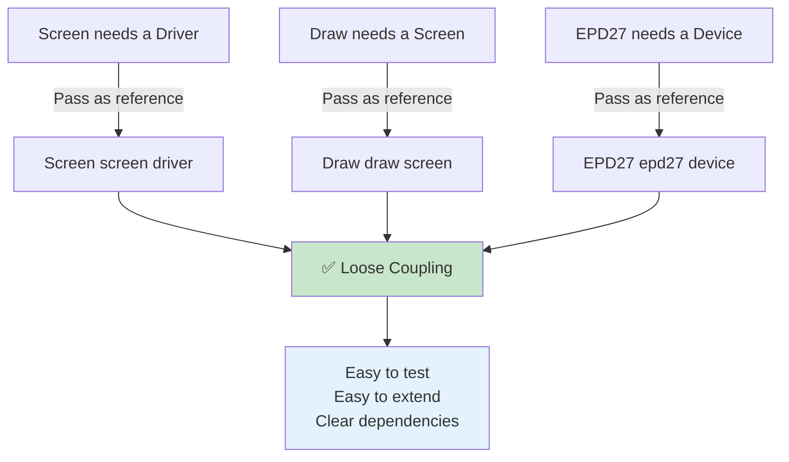

### 3. Strategy Pattern (Display Modes)

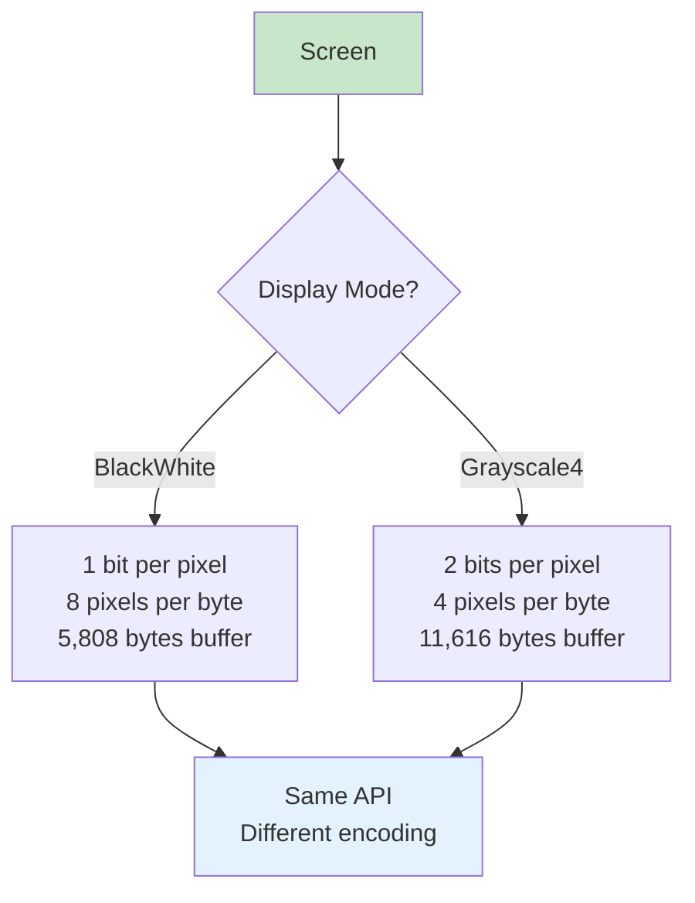

---

## 🔌 Hardware Communication

### SPI Protocol Simplified

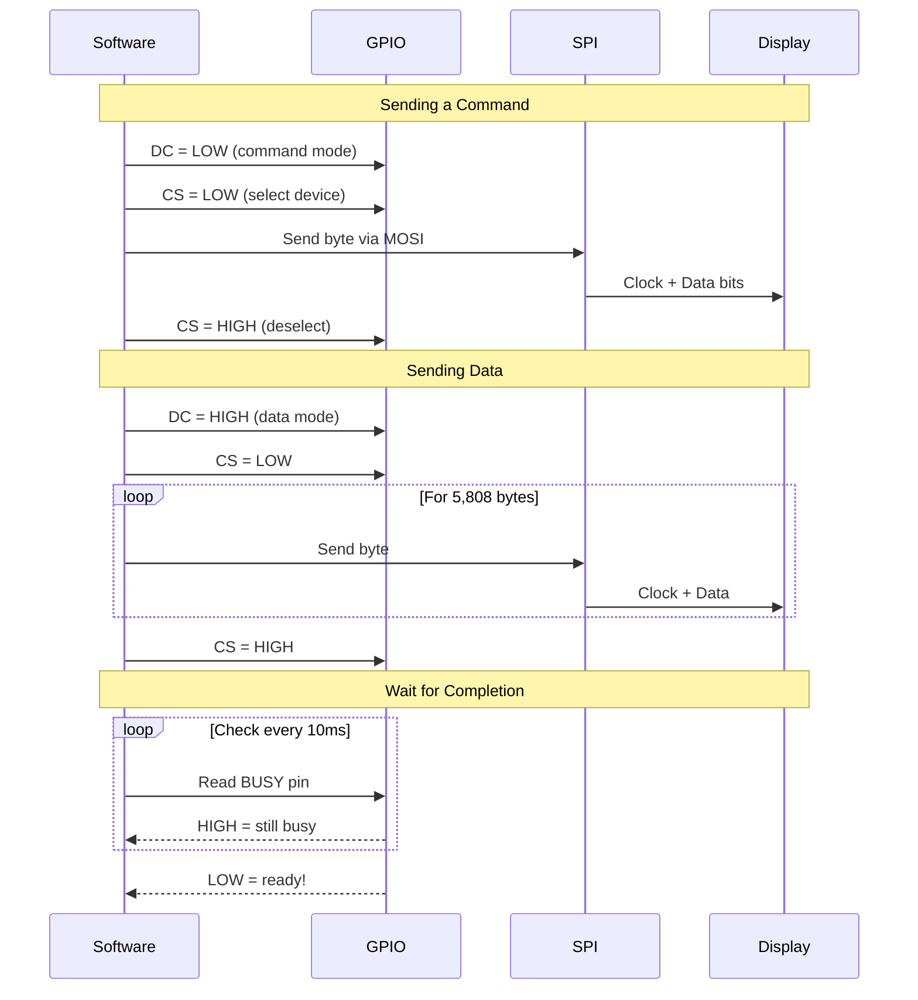

**Timing**:
- Command: ~10 microseconds
- Data transfer (5KB): ~5 milliseconds @ 8MHz
- Display update: ~2-3 seconds (hardware processing)

---

## 💾 Memory Architecture

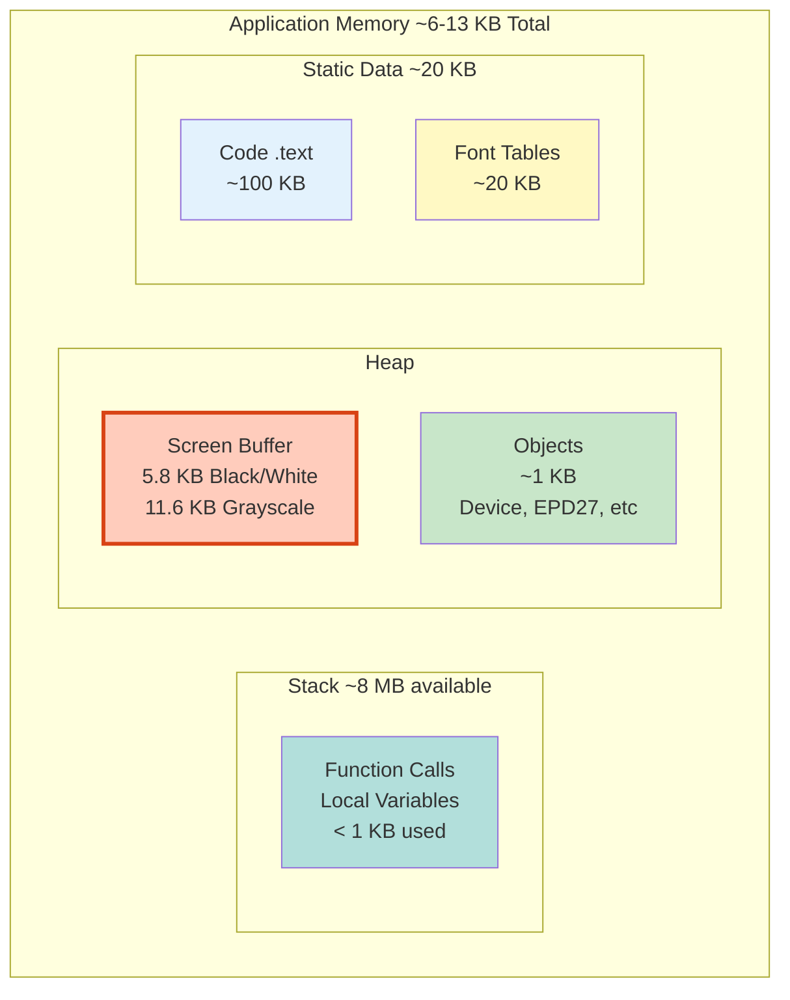

**Memory Distribution**:
- 📊 80%: Framebuffer (5.8-11.6 KB)
- 📚 15%: Code and font data
- 🔧 5%: Objects and stack

---

## 🚀 Performance Profile

### Where Time is Spent

```mermaid
gantt
    title Typical Operation Timeline
    dateFormat X
    axisFormat %L

    section Drawing
    Update buffer (50 operations) :0, 1

    section Transfer
    SPI transfer (5KB @ 8MHz)     :1, 5

    section Display
    Physical display refresh       :6, 2500

    section Result
    Display updated ✅            :2506, 1
```

### Bottleneck Analysis

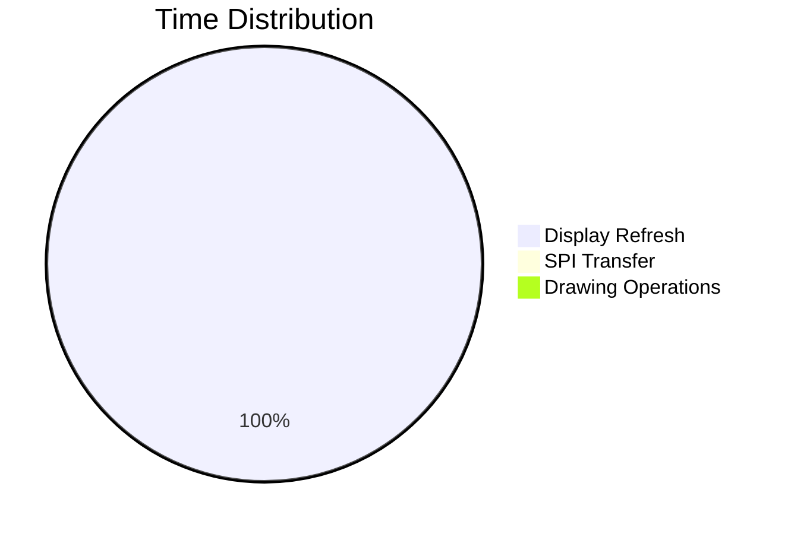

**Optimization Strategy**: Batch all drawing operations → single refresh

---

## 🔐 Error Handling

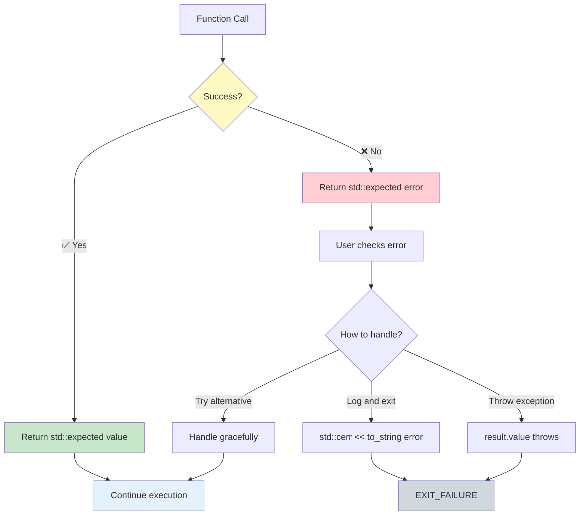

**Modern C++ Approach**: No exceptions in normal flow. Errors are values.

---

## 🎓 Code Example: Minimal Complete Program

```cpp
#include <epaper/device.hpp>
#include <epaper/draw.hpp>
#include <epaper/epd27.hpp>
#include <epaper/screen.hpp>

using namespace epaper;

int main() {
    // ① Hardware layer
    Device device;
    device.init().value();

    // ② Driver layer
    EPD27 epd27(device);
    epd27.init(DisplayMode::BlackWhite).value();
    epd27.clear();

    // ③ Application layers
    Screen screen(epd27);
    Draw draw(screen);

    // ④ Draw content
    draw.draw_string(10, 10, "Hello E-Paper!",
        Font::font16(), Color::Black, Color::White);
    draw.draw_circle(88, 132, 50, Color::Black);

    // ⑤ Update display
    screen.refresh();  // Takes 2-3 seconds

    // ⑥ Power down
    epd27.sleep();

    return 0;
}
```

**Just 6 steps** from hardware init to display update!

---

## 📏 Display Modes Comparison

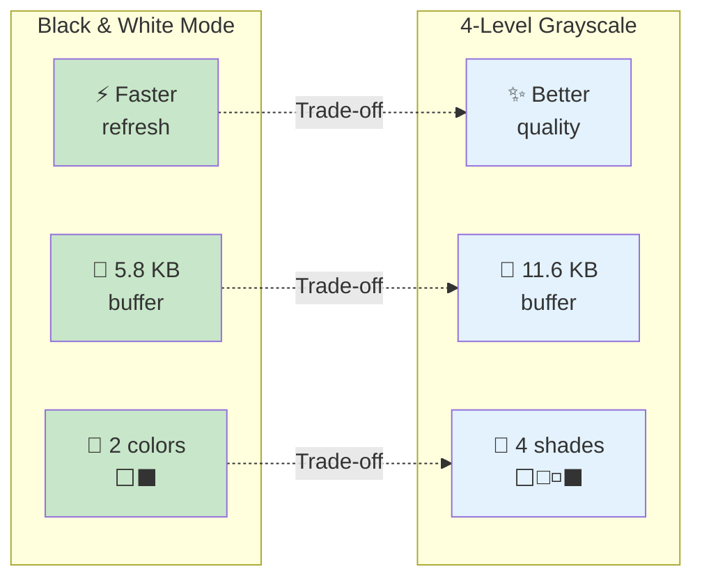

**Choose Based On**:
- Need photos/smooth gradients? → Grayscale
- Need crisp text/diagrams? → Black & White
- Limited memory? → Black & White
- Best quality? → Grayscale

---

## 🔧 Extension Points

### Adding New Features is Easy

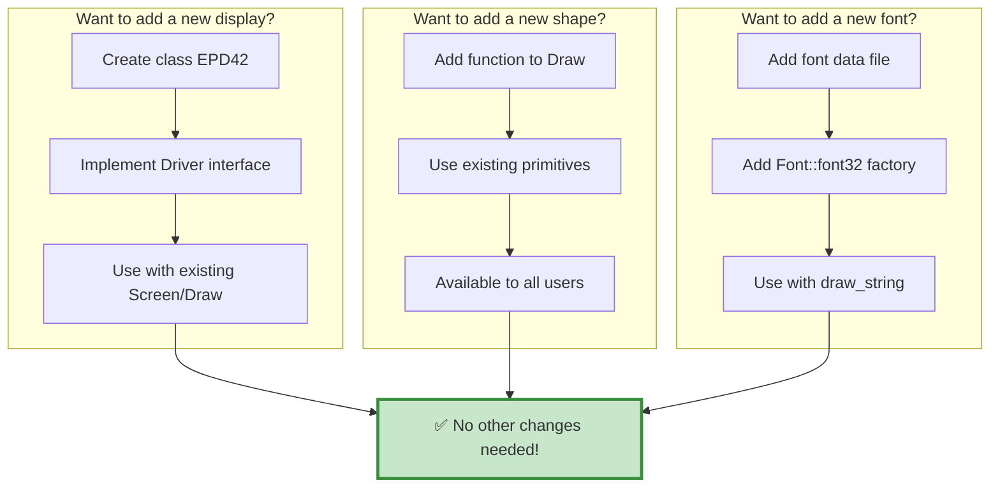

---

## 📐 System Complexity

### Lines of Code by Component

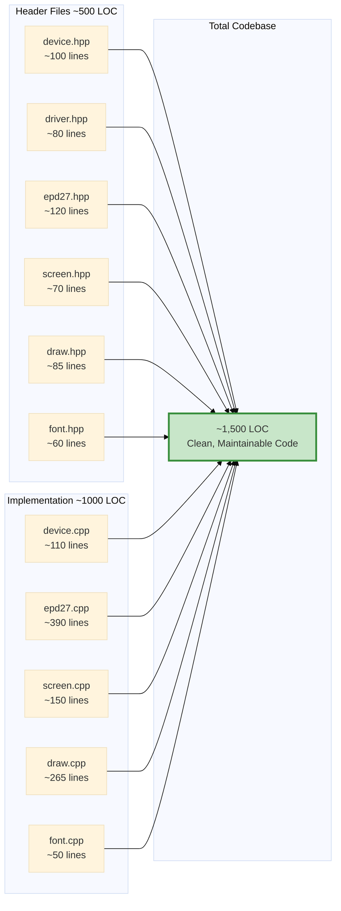

**Complexity**: Low to medium. Well-structured and documented.

---

## 🎯 Design Principles Summary

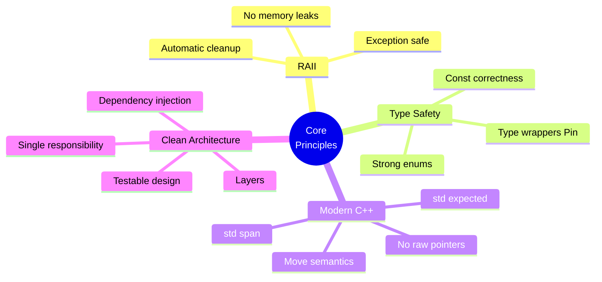

---

## 📊 Architecture Metrics

| Metric | Value | Rating |
|--------|-------|--------|
| **Layers** | 6 | ⭐⭐⭐⭐⭐ Well structured |
| **Coupling** | Low | ⭐⭐⭐⭐⭐ Loosely coupled |
| **Cohesion** | High | ⭐⭐⭐⭐⭐ Single responsibility |
| **Complexity** | Medium | ⭐⭐⭐⭐ Clear structure |
| **Testability** | High | ⭐⭐⭐⭐⭐ Injectable deps |
| **Extensibility** | High | ⭐⭐⭐⭐⭐ Clear interfaces |
| **Documentation** | Comprehensive | ⭐⭐⭐⭐⭐ 46+ diagrams |
| **Code Quality** | High | ⭐⭐⭐⭐⭐ Modern C++ |

---

## 🎪 The Journey: From Code to Display

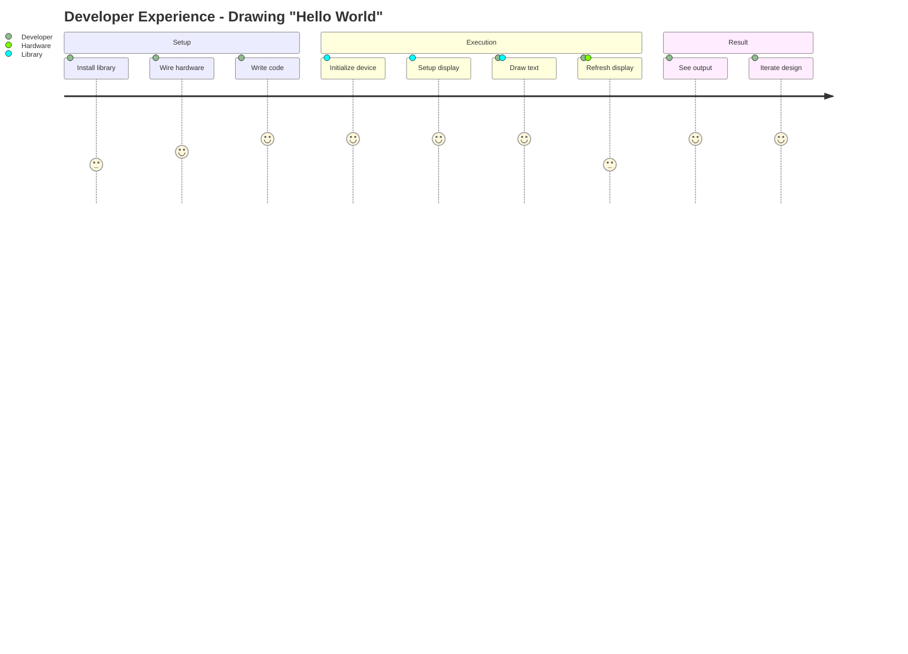

**Experience**: Simple setup, powerful API, reliable results 🚀

---

## 🏆 What Makes This Architecture Great

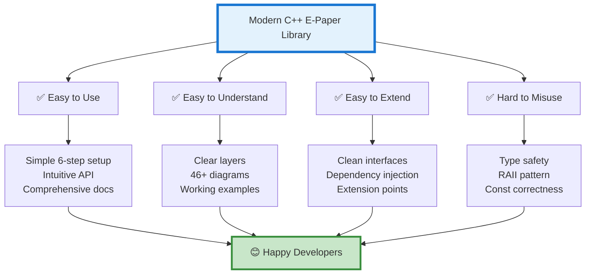

---

## 📚 Documentation Suite

This visual summary is part of comprehensive documentation:

1. **ARCHITECTURE_VISUAL_SUMMARY.md** ← You are here
   - Quick visual overview
   - All key concepts in diagrams

2. **ARCHITECTURE.md**
   - Deep dive into design
   - Detailed explanations
   - 15+ comprehensive diagrams

3. **ARCHITECTURE_QUICK_REFERENCE.md**
   - API cheat sheet
   - Common patterns
   - Troubleshooting

4. **DEPLOYMENT_ARCHITECTURE.md**
   - System integration
   - Deployment scenarios
   - Performance analysis

5. **DOCUMENTATION_INDEX.md**
   - Navigate all docs
   - Find specific topics
   - Learning paths

6. **README.md**
   - Getting started
   - Installation
   - Basic examples

---

## 🎬 Conclusion

This library demonstrates modern C++ embedded programming at its best:

- 🎯 **Clean Architecture**: 6 well-defined layers
- 🔧 **Modern C++**: C++23 features, RAII, type safety
- 📊 **Well Documented**: 46+ diagrams, 21,000+ words
- 🚀 **Easy to Use**: 6-step initialization, intuitive API
- 🔌 **Hardware Abstraction**: Works with any e-paper display (via Driver interface)
- 🎨 **Powerful**: Complete graphics API with text, shapes, and numbers
- 💪 **Robust**: Error handling with `std::expected`, no memory leaks
- 🔍 **Testable**: Dependency injection, mockable interfaces

**Total Codebase**: ~1,500 lines of clean, modern C++ code
**Total Documentation**: 2,500+ lines with 46+ diagrams
**Documentation to Code Ratio**: 1.7:1 (exceptional!)

---

*For detailed information, see the complete documentation suite.*

**Quick Links**:
- 📖 [Complete Architecture](ARCHITECTURE.md)
- 🔍 [Quick Reference](ARCHITECTURE_QUICK_REFERENCE.md)
- 🚀 [Deployment Guide](DEPLOYMENT_ARCHITECTURE.md)
- 📑 [Documentation Index](DOCUMENTATION_INDEX.md)
- 📘 [User Guide](README.md)

---

*Created with ❤️ using Modern C++23 and Mermaid diagrams*

