# Architecture Guide

A comprehensive technical guide to the libepaper architecture, design decisions, and implementation details.

## Table of Contents

- [Design Philosophy](#design-philosophy)
- [System Architecture](#system-architecture)
- [Component Deep Dive](#component-deep-dive)
- [Data Flow](#data-flow)
- [Design Decisions](#design-decisions)
- [Hardware Interface](#hardware-interface)
- [Performance Considerations](#performance-considerations)
- [Error Handling Strategy](#error-handling-strategy)
- [Testing Architecture](#testing-architecture)
- [Future Extensions](#future-extensions)

## Design Philosophy

The libepaper library is built on modern C++23 principles prioritizing safety, simplicity, and extensibility.

### Core Principles

1. **Modern C++23**: Leverage the latest language features for safety and expressiveness
   - `std::expected` for type-safe error handling
   - `std::span` for non-owning views
   - Concepts for type constraints
   - Ranges for elegant algorithms

2. **Composition Over Inheritance**: Minimize inheritance hierarchies
   - Favor composition and dependency injection
   - Single abstract `Driver` interface as the only inheritance point
   - RAII wrappers composed into larger systems

3. **RAII Everywhere**: Automatic resource management
   - No manual `new`/`delete`
   - Resources tied to object lifetime
   - Exception-safe by design

4. **Type Safety**: Strong typing prevents errors at compile time
   - Enums for modes, orientations, colors
   - Type-safe wrappers around raw values
   - No implicit conversions

5. **Zero-Cost Abstractions**: Modern C++ with no runtime overhead
   - Templates and constexpr for compile-time resolution
   - Inlining for hot paths
   - Move semantics for efficient transfers

## System Architecture

### High-Level Architecture

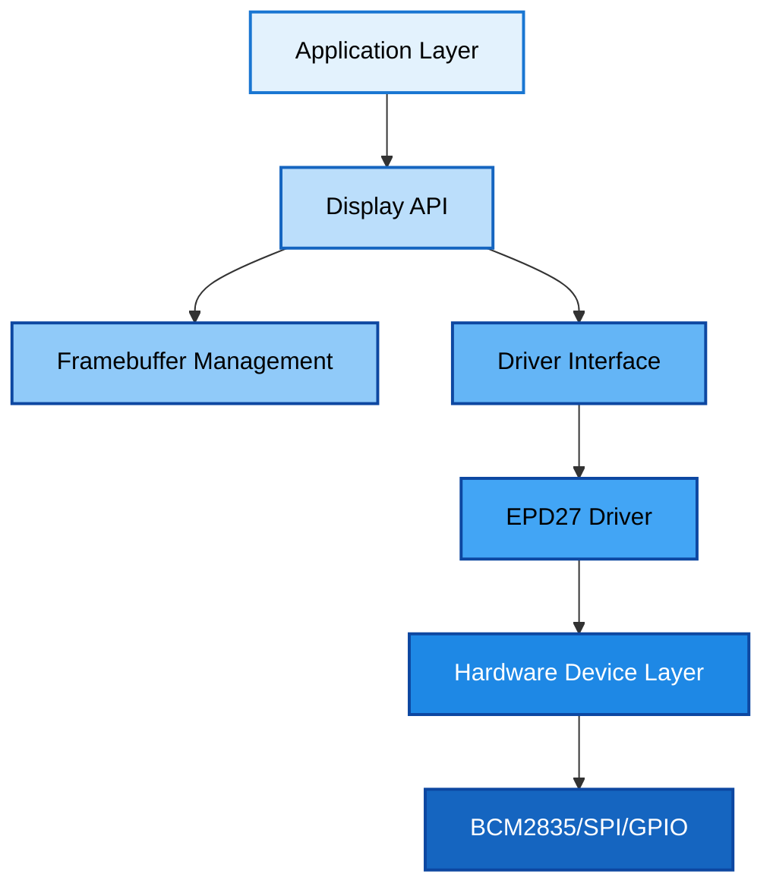

### Layer Responsibilities

**Application Layer**
- User code and business logic
- Example: crypto dashboard, weather station
- Uses the Display API to draw and refresh

**Display API Layer** (`display.hpp`)
- High-level drawing operations
- Coordinate transformation (orientation)
- Auto-sleep management
- Error handling and validation

**Framebuffer Management** (`framebuffer.hpp`)
- Pixel buffer storage and manipulation
- Pixel format conversion (1-bit, 2-bit)
- Bounds checking and clipping
- Buffer access abstraction

**Driver Interface** (`drivers/driver.hpp`)
- Abstract contract for display hardware
- Hardware-independent operations
- Capability queries
- Sleep/wake lifecycle

**Concrete Driver** (`drivers/epd27.cpp`)
- EPD27-specific implementation
- Command sequences and timing
- LUT (Look-Up Table) management
- Hardware state tracking

**Hardware Device Layer** (`device.hpp`)
- BCM2835 GPIO/SPI wrapper
- RAII resource management
- Pin control and SPI transfers
- Low-level hardware interface

## Component Deep Dive

### Device Layer: BCM2835 Hardware Interface

The `Device` class wraps the BCM2835 library for safe hardware access.

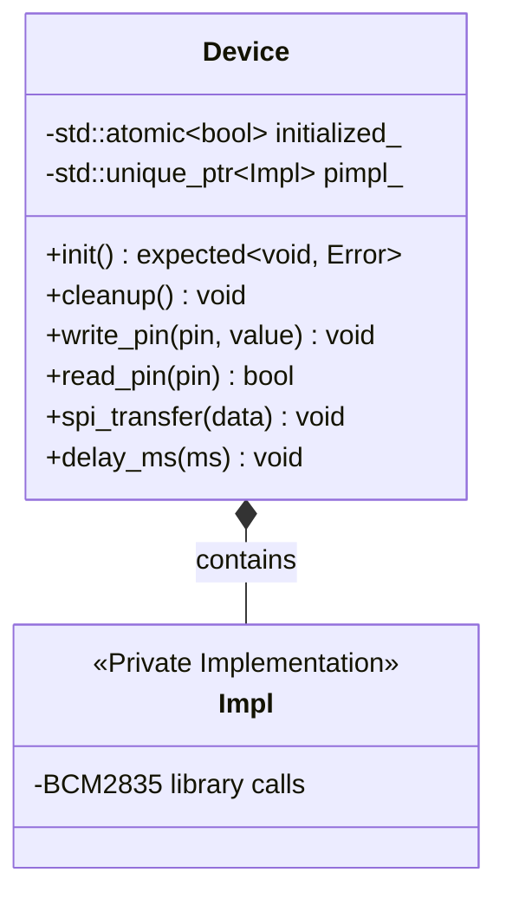

**Key Features:**
- **RAII**: Constructor/destructor manage BCM2835 library lifecycle
- **Atomic State**: Thread-safe initialization tracking
- **PImpl**: Hide BCM2835 library details from public interface
- **Error Handling**: Returns `std::expected` for init failures

**Why This Design:**
- **Testability**: Can mock `Device` for unit tests
- **Encapsulation**: BCM2835 details don't leak into headers
- **Resource Safety**: Automatic cleanup prevents resource leaks

### Driver Interface: Hardware Abstraction

The abstract `Driver` class defines the contract for display hardware.

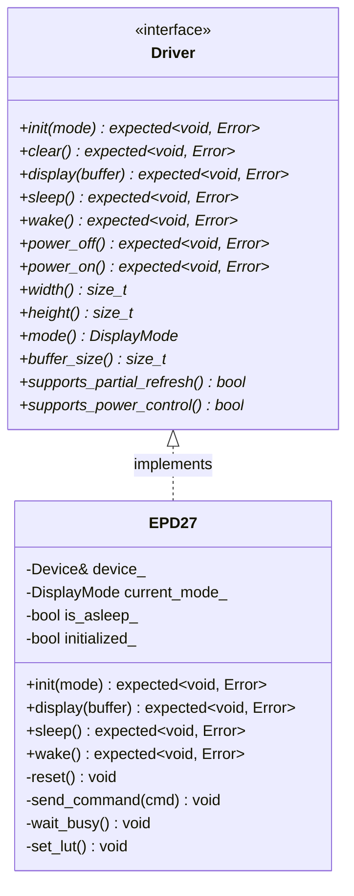

**Interface Segregation:**
- Minimal required methods (pure virtual)
- Optional capabilities via capability queries
- No forced implementations of unsupported features

**Why Abstract Interface:**
- **Extensibility**: Easy to add new displays (4.2", 7.5", etc.)
- **Polymorphism**: `Display` class works with any driver
- **Testing**: Mock drivers for unit tests
- **Separation of Concerns**: Hardware details isolated in drivers

### Display Class: High-Level API

The `Display` class provides user-facing drawing operations and manages display state.

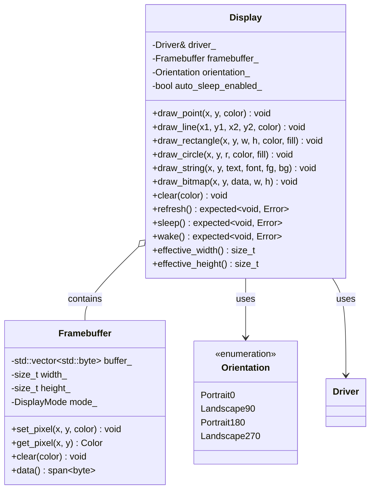

**Coordinate Transformation:**
The `Display` class transparently handles coordinate rotation based on `Orientation`:

```cpp
// Internal coordinate transformation
auto transform_coordinates(size_t x, size_t y, Orientation orient) -> std::pair<size_t, size_t> {
  switch (orient) {
    case Orientation::Portrait0:   return {x, y};
    case Orientation::Landscape90: return {height - 1 - y, x};
    case Orientation::Portrait180: return {width - 1 - x, height - 1 - y};
    case Orientation::Landscape270: return {y, width - 1 - x};
  }
}
```

**Transparent Sleep/Wake Management:**

The library now handles sleep/wake cycles automatically:

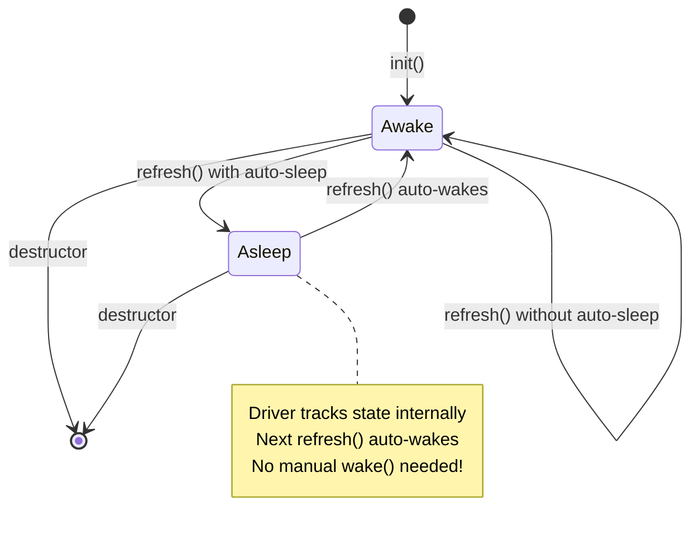

**Key Features:**
- **Auto-Sleep**: Prevents burn-in by sleeping after refresh (configurable)
- **Auto-Wake**: Transparently wakes display when rendering (EPD27 re-initializes)
- **State Tracking**: Driver maintains `is_asleep_` flag for idempotent operations
- **Developer Ergonomics**: No manual sleep/wake management needed

### Color Management

The library supports both black/white and grayscale displays with a unified color system.

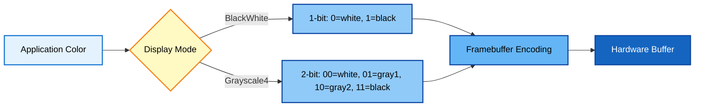

**Color Enum:**
```cpp
enum class Color {
  White,  // Lightest (0)
  Gray1,  // Light gray (grayscale mode only)
  Gray2,  // Dark gray (grayscale mode only)
  Black   // Darkest (3)
};
```

**Framebuffer Encoding:**
- **BlackWhite mode**: 1 bit per pixel, packed 8 pixels per byte
- **Grayscale4 mode**: 2 bits per pixel, packed 4 pixels per byte

### Automatic Color Conversion

The library includes a sophisticated color management system that automatically handles color conversion from RGB/RGBA to display-appropriate formats.

**ColorManager Class:**

The `ColorManager` (in `include/epaper/color/color_manager.hpp`) provides automatic conversion:

```cpp
// RGB to Grayscale conversion using standard formula
auto rgb_to_gray(const RGB& color) -> uint8_t {
  return 0.299 * R + 0.587 * G + 0.114 * B;
}

// Automatic quantization based on display mode
BlackWhite mode:  gray >= 128 ? White : Black
Grayscale4 mode:  0-63 → Black, 64-127 → Gray2, 128-191 → Gray1, 192-255 → White
```

**Image Loading with Automatic Conversion:**

When you load images (PNG, JPEG, BMP, TGA, GIF, PSD, HDR), the library automatically:

1. **Loads** the image using stb_image
2. **Converts** RGB/RGBA to grayscale using standard luminance formula
3. **Quantizes** to display's color depth (1-bit or 2-bit)
4. **Renders** to framebuffer

```cpp
// Load a full-color photo - automatic conversion!
display->draw_bitmap_from_file(0, 0, "colorful_photo.png");

// Library automatically handles:
// 1. PNG decode → RGB
// 2. RGB → Grayscale (0.299*R + 0.587*G + 0.114*B)
// 3. Grayscale → 4-level quantization (if in Grayscale4 mode)
// 4. Draw to framebuffer
```

**Benefits:**
- **Zero manual work**: Load any color image without preprocessing
- **Intelligent quantization**: Uses perceptual grayscale conversion
- **Format agnostic**: Works with PNG, JPEG, BMP, and more
- **Mode aware**: Automatically adapts to BlackWhite or Grayscale4 display mode

This means developers can use standard color images and the library handles all conversion automatically.

## Data Flow

### Display Refresh Flow

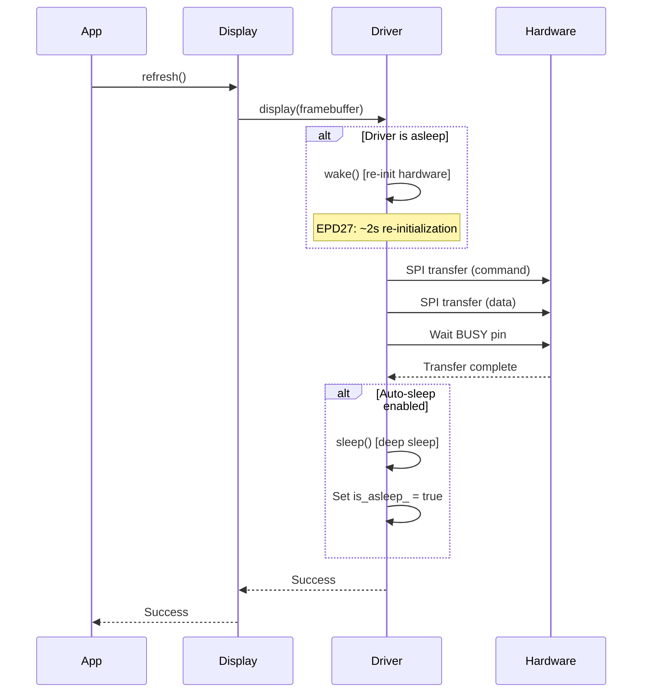

### Drawing Operation Flow

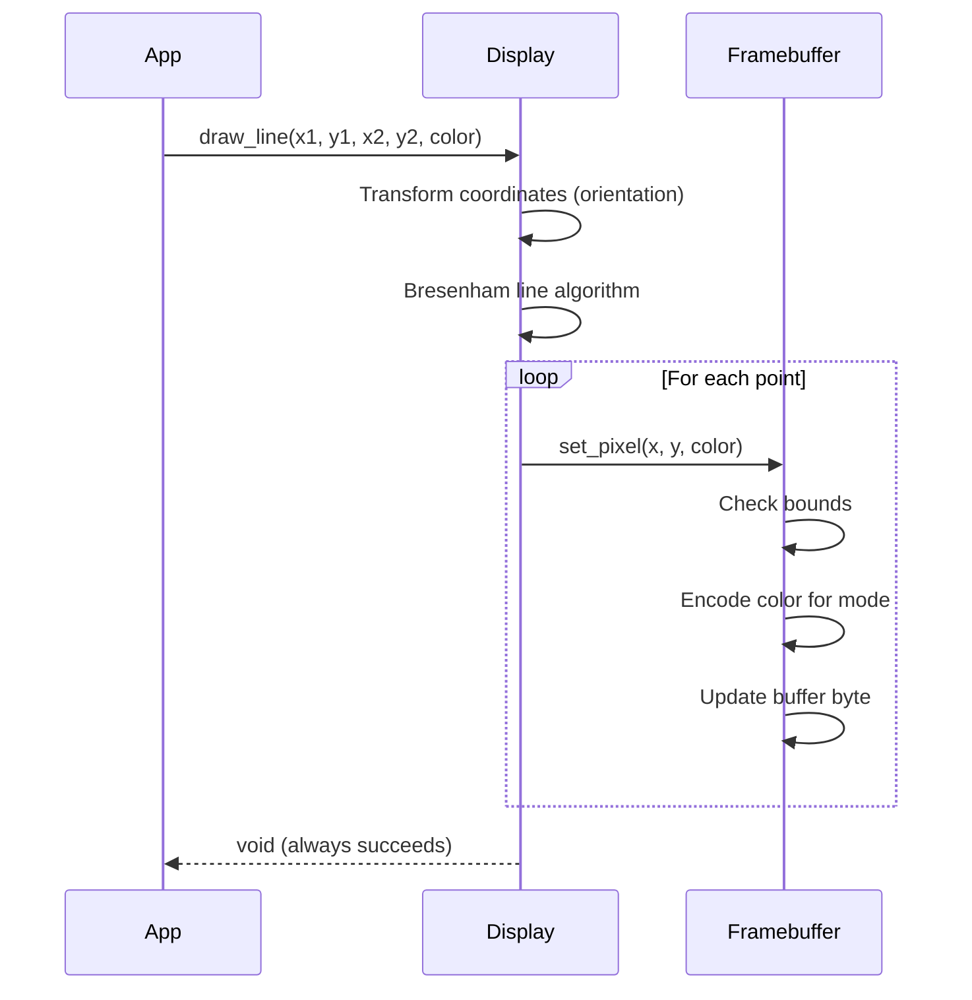

### Initialization Flow

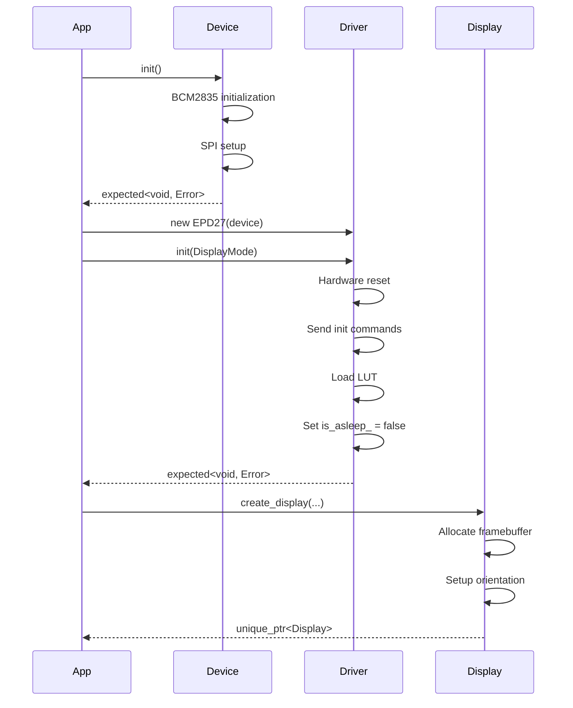

## Design Decisions

### Why `std::expected` Over Exceptions?

**Decision:** Use `std::expected<T, Error>` for recoverable errors instead of exceptions.

**Rationale:**
1. **Explicit Error Handling**: Caller must check result (no silent failures)
2. **Performance**: No exception unwinding overhead in hot paths
3. **Predictable Control Flow**: Clear success/error paths
4. **Composability**: Monadic operations (`and_then`, `or_else`) for error chains
5. **Resource-Constrained**: Better for embedded systems (Raspberry Pi)

**Trade-offs:**
- **Verbosity**: Must explicitly check each result
- **Learning Curve**: Newer C++23 feature
- **Benefits**: Type safety, performance, explicitness

### Why Transparent Sleep/Wake Management?

**Problem:** EPD27 hardware requires deep sleep to prevent burn-in, but doesn't support wake without full re-initialization.

**Previous Approach (Manual):**
```cpp
display->refresh();  // First render
display->sleep();    // Developer must remember!

// Later...
display->wake();     // May fail - EPD27 doesn't support wake!
display->refresh();  // Hangs if still asleep
```

**New Approach (Transparent):**
```cpp
display->refresh();  // First render, auto-sleeps

// Later...
display->refresh();  // Auto-wakes if needed, just works!
```

**Implementation:**
- Driver maintains `bool is_asleep_` state
- `sleep()` sets flag, `init()` clears flag
- `display()` checks flag and calls `wake()` (re-init) if needed
- `wake()` is idempotent (no-op if already awake)

**Benefits:**
1. **Developer Ergonomics**: No manual sleep/wake management
2. **Correctness**: Impossible to forget to wake
3. **Hardware Abstraction**: Hide EPD27 limitation from users
4. **Consistent API**: Same code works for different displays

### Why Composition Over Inheritance?

**Decision:** Minimize inheritance, prefer composition and dependency injection.

**Example: Display Construction**
```cpp
// Composition: Display receives driver by reference
class Display {
  Driver& driver_;           // Reference to driver (dependency injection)
  Framebuffer framebuffer_;  // Composed framebuffer
  Orientation orientation_;  // Composed state
};

// NOT: class Display : public Driver { }  // Inheritance would couple tightly
```

**Benefits:**
1. **Flexibility**: Easily swap drivers at runtime
2. **Testability**: Mock drivers for unit tests
3. **Simplicity**: Flat structure, no deep hierarchies
4. **Single Responsibility**: Each class has one job

### Why Abstract Driver Interface?

**Decision:** Single abstract `Driver` interface, not multiple interfaces.

**Rationale:**
1. **Extensibility**: Add new displays by implementing one interface
2. **Polymorphism**: `Display` works with any conforming driver
3. **Interface Segregation**: Optional features via capability queries
4. **Clear Contract**: Well-defined responsibilities

**Future-Proof:**
- Can add new display sizes without changing architecture
- Can support color displays by extending `Color` enum
- Can add partial refresh if hardware supports it

### Memory Management Strategy

**Decision:** RAII for all resources, no manual `new`/`delete`.

**Patterns:**
1. **std::unique_ptr**: For polymorphic objects (`create_display` returns `unique_ptr<Display>`)
2. **std::vector**: For dynamic buffers (framebuffer storage)
3. **std::span**: For non-owning views (buffer passing to driver)
4. **References**: For composition (driver reference in Display)
5. **Value Semantics**: For small objects (Color, Orientation enums)

**Benefits:**
- **Exception Safety**: Resources freed even on exception
- **No Leaks**: Impossible to forget to free
- **Move Semantics**: Efficient transfers without copying

## Hardware Interface

### SPI Communication Protocol

The e-paper display uses SPI for communication with a command/data distinction.

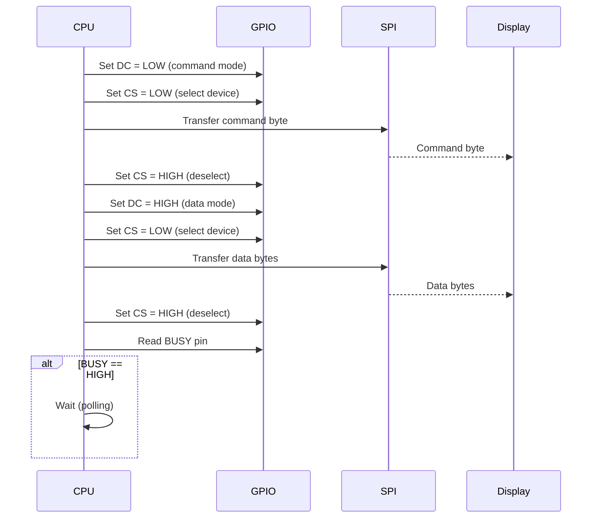

**Pin Roles:**
- **DC (Data/Command)**: LOW = command, HIGH = data
- **CS (Chip Select)**: LOW = device selected, HIGH = device idle
- **RST (Reset)**: LOW = reset, HIGH = normal operation
- **BUSY**: HIGH = display busy, LOW = ready for commands

### EPD27 Command Set

Key commands used by the EPD27 driver:

| Command | Hex | Description |
|---------|-----|-------------|
| DRIVER_OUTPUT_CONTROL | 0x01 | Set scanning parameters |
| BOOSTER_SOFT_START | 0x0C | Configure booster |
| GATE_SCAN_START | 0x0F | Set gate scan start position |
| DEEP_SLEEP_MODE | 0x10 | Enter deep sleep |
| DATA_ENTRY_MODE | 0x11 | Set data entry sequence |
| SW_RESET | 0x12 | Software reset |
| TEMPERATURE_SENSOR | 0x1A | Read temperature sensor |
| MASTER_ACTIVATION | 0x20 | Activate display update |
| DISPLAY_UPDATE_CONTROL | 0x21 | Configure update sequence |
| WRITE_RAM | 0x24 | Write framebuffer to RAM |
| WRITE_VCOM_REGISTER | 0x2C | Set VCOM voltage |
| WRITE_LUT_REGISTER | 0x32 | Load look-up table |
| SET_RAM_X | 0x44 | Set RAM X address |
| SET_RAM_Y | 0x45 | Set RAM Y address |
| SET_RAM_X_COUNTER | 0x4E | Set RAM X counter |
| SET_RAM_Y_COUNTER | 0x4F | Set RAM Y counter |

### Initialization Sequence

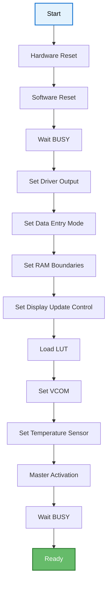

### Pin Configuration

Default Raspberry Pi GPIO pin assignments:

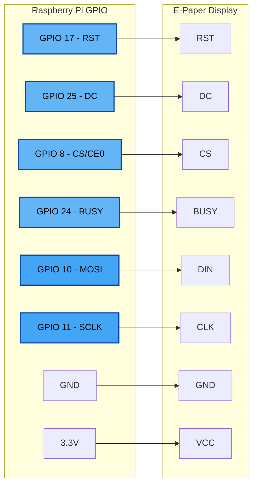

## Performance Considerations

### Framebuffer Size

Memory footprint varies by display mode:

**2.7" Display (176x264 pixels = 46,464 pixels):**
- **Black/White mode**: 5,808 bytes (46,464 bits / 8)
- **Grayscale4 mode**: 11,616 bytes (46,464 * 2 bits / 8)

**Larger Displays (hypothetical 4.2" - 400x300 = 120,000 pixels):**
- **Black/White mode**: 15,000 bytes
- **Grayscale4 mode**: 30,000 bytes

### Refresh Times

Approximate refresh times for EPD27:

- **Full Refresh**: ~2 seconds (hardware limitation)
- **Wake from Sleep**: ~2 seconds (requires full re-initialization)
- **Partial Refresh**: Not supported by EPD27 hardware

**Optimization Tips:**
- Batch drawing operations before calling `refresh()`
- Minimize `refresh()` calls (e.g., 5-second intervals for live data)
- Use auto-sleep to protect hardware between refreshes

### SPI Transfer Rates

The BCM2835 SPI operates at configurable speeds:
- **Default**: 8 MHz (conservative, reliable)
- **Maximum**: 32 MHz (may cause errors with long wires)

**Framebuffer Transfer Time:**
- At 8 MHz: ~6ms for 5,808 bytes (black/white mode)
- Negligible compared to display refresh time (~2s)

## Error Handling Strategy

### Error Types

```cpp
enum class ErrorCode {
  // Device errors (hardware layer)
  DeviceNotInitialized,
  DeviceInitFailed,
  SPIInitFailed,
  InvalidPin,
  TransferFailed,

  // Driver errors (display layer)
  DriverNotInitialized,
  DriverInitFailed,
  InvalidDisplayMode,
  HardwareTimeout,

  // Display errors (API layer)
  DisplayNotReady,
  RefreshFailed,

  // File I/O errors
  FileNotFound,
  InvalidFormat,
  LoadFailed
};

struct Error {
  ErrorCode code;
  std::string message;  // Optional context
  auto what() const -> std::string_view;
};
```

### Recovery Strategies

**1. Initialization Errors:**
```cpp
auto result = device.init();
if (!result) {
  // Fatal - cannot proceed
  std::cerr << "Hardware init failed: " << result.error().what() << "\n";
  return 1;
}
```

**2. Transient Errors:**
```cpp
auto result = display->refresh();
if (!result) {
  // Retry with exponential backoff
  std::this_thread::sleep_for(std::chrono::milliseconds(100));
  result = display->refresh();  // Retry
}
```

**3. Benign Errors:**
```cpp
// Drawing operations never fail - out of bounds is clipped
display->draw_point(1000, 1000, Color::Black);  // Safely ignored
```

## Testing Architecture

### Test Organization

```
tests/
├── test_auto_sleep.cpp          # Auto-sleep behavior
├── test_bitmaps.cpp             # Bitmap drawing
├── test_coordinate_transforms.cpp  # Orientation transforms
├── test_display_modes.cpp       # Black/white vs grayscale
├── test_drawing_primitives.cpp  # Lines, circles, etc.
├── test_edge_cases.cpp          # Boundary conditions
├── test_error_handling.cpp      # Error propagation
├── test_fonts.cpp               # Font rendering
├── test_orientations.cpp        # Display rotation
├── test_power_management.cpp    # Sleep/wake cycles
└── test_stress.cpp              # Performance & stability
```

### Hardware Mocking Strategy

For CI/CD and unit tests without Raspberry Pi hardware:

```cpp
class MockDevice : public Device {
  // Stub implementations for testing
  auto init() -> std::expected<void, Error> override {
    return {};  // Always succeed
  }

  auto spi_transfer(std::span<const std::byte> data) -> void override {
    // Record call for verification
    spi_calls_.push_back({data.begin(), data.end()});
  }

  std::vector<std::vector<std::byte>> spi_calls_;  // For assertions
};
```

## Future Extensions

### Partial Refresh Support

Some e-paper displays support partial refresh (faster updates of screen regions).

**Requirements:**
- Hardware support (EPD27 doesn't support this)
- Driver capability query: `supports_partial_refresh()`
- New API: `refresh_region(x, y, width, height)`

### Color Display Support

Adding red/yellow e-paper displays would require:

**1. Extend Color Enum:**
```cpp
enum class Color {
  White, Black,  // Monochrome
  Gray1, Gray2,  // Grayscale
  Red, Yellow    // Color displays (NEW)
};
```

**2. Update Framebuffer Encoding:**
- 3 bits per pixel for 8 colors
- Separate red/black buffers (some displays use this)

**3. Driver Implementation:**
- Two-pass display update (black, then color)
- Color-specific LUTs

### Additional Display Drivers

**Easy to Add:**
- 1.54" displays (200x200)
- 4.2" displays (400x300)
- 7.5" displays (800x480)

**Process:**
1. Implement `Driver` interface
2. Add initialization sequence from datasheet
3. Add driver-specific commands
4. Write tests
5. Done! All existing APIs work automatically.

---

**For driver development details, see [DRIVER.md](DRIVER.md).**
**For API usage, see [API.md](API.md).**
