# E-Paper Display - Deployment Architecture

## Table of Contents
1. [Physical Deployment](#physical-deployment)
2. [Software Stack](#software-stack)
3. [Process Architecture](#process-architecture)
4. [Communication Protocols](#communication-protocols)
5. [System Integration](#system-integration)
6. [Resource Management](#resource-management)

---

## Physical Deployment

### Hardware Deployment Diagram

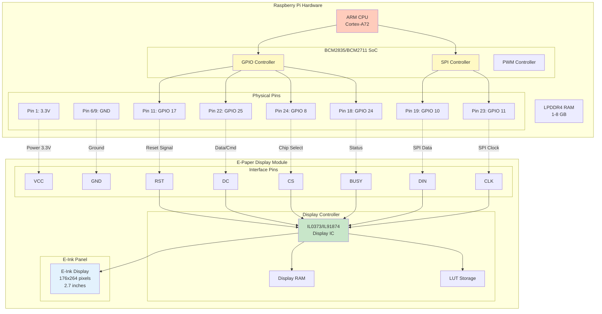

### Physical Connection Details

| Connection | Type | Speed | Voltage | Purpose |
|------------|------|-------|---------|---------|
| **Power (VCC/GND)** | DC Power | N/A | 3.3V | Display power supply |
| **RST (GPIO 17)** | Digital Output | 1 MHz | 3.3V | Hardware reset control |
| **DC (GPIO 25)** | Digital Output | 1 MHz | 3.3V | Data/Command mode select |
| **CS (GPIO 8)** | Digital Output | 1 MHz | 3.3V | SPI chip select |
| **BUSY (GPIO 24)** | Digital Input | 1 MHz | 3.3V | Display busy status |
| **DIN/MOSI (GPIO 10)** | SPI | 4-16 MHz | 3.3V | Serial data transmission |
| **CLK/SCLK (GPIO 11)** | SPI | 4-16 MHz | 3.3V | Serial clock |

---

## Software Stack

### Full Software Stack Diagram

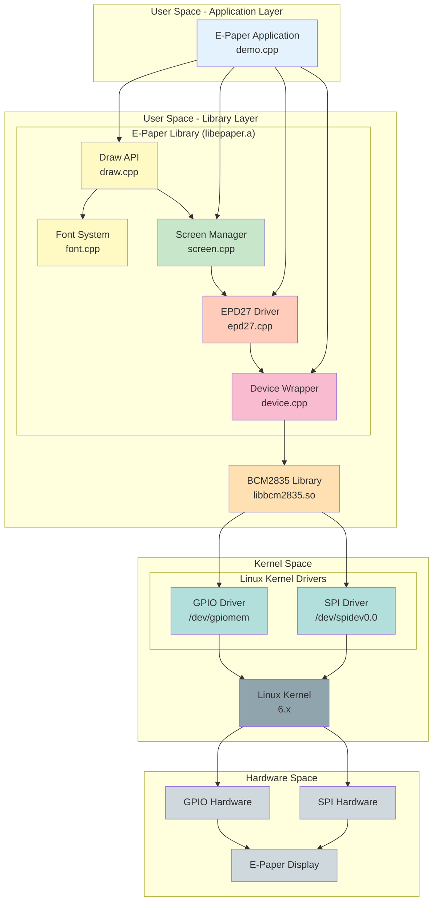

### Layer Responsibilities

| Layer | Component | Privileges | Function |
|-------|-----------|------------|----------|
| **Application** | demo.cpp | User | Business logic, display content |
| **High-Level API** | Draw, Font | User | Graphics primitives |
| **Buffer Management** | Screen | User | Framebuffer operations |
| **Driver Logic** | EPD27 | User | Display protocol implementation |
| **HAL** | Device, BCM2835 | Root/GPIO group | Hardware access abstraction |
| **Kernel** | GPIO/SPI drivers | Kernel | Device drivers |
| **Hardware** | BCM2835 SoC | N/A | Physical hardware |

---

## Process Architecture

### Runtime Process Structure

```mermaid
graph TB
    subgraph "Process: epaper_demo"
        MAIN[Main Thread]

        subgraph "Memory Segments"
            TEXT[.text<br/>Code Segment<br/>~100 KB]
            DATA[.data/.bss<br/>Static Data<br/>~20 KB]
            HEAP[Heap<br/>Framebuffer: 5-12 KB<br/>Objects: ~1 KB]
            STACK[Stack<br/>~8 MB default]
        end

        subgraph "Memory Mapped I/O"
            GPIO_MEM[/dev/gpiomem<br/>GPIO registers]
            SPI_MEM[/dev/spidev0.0<br/>SPI interface]
        end
    end

    MAIN --> TEXT
    MAIN --> DATA
    MAIN --> HEAP
    MAIN --> STACK

    MAIN --> GPIO_MEM
    MAIN --> SPI_MEM

    GPIO_MEM -.->|mmap| GPIO_REG[Physical GPIO<br/>0x3F200000]
    SPI_MEM -.->|ioctl| SPI_REG[Physical SPI<br/>0x3F204000]

    style MAIN fill:#e3f2fd
    style TEXT fill:#fff9c4
    style HEAP fill:#c8e6c9
    style GPIO_MEM fill:#ffccbc
    style SPI_MEM fill:#ffccbc
```

### Memory Map

| Segment | Size | Content | Allocation |
|---------|------|---------|------------|
| **Text** | ~100 KB | Compiled code | Static |
| **Data** | ~20 KB | Global variables, font tables | Static |
| **Heap** | 6-13 KB | Framebuffer (5.8-11.6 KB), objects (~1 KB) | Dynamic |
| **Stack** | 8 MB | Function calls, local variables | Dynamic |
| **MMIO** | 4 KB pages | GPIO/SPI register access | Kernel mapped |

---

## Communication Protocols

### SPI Communication Protocol

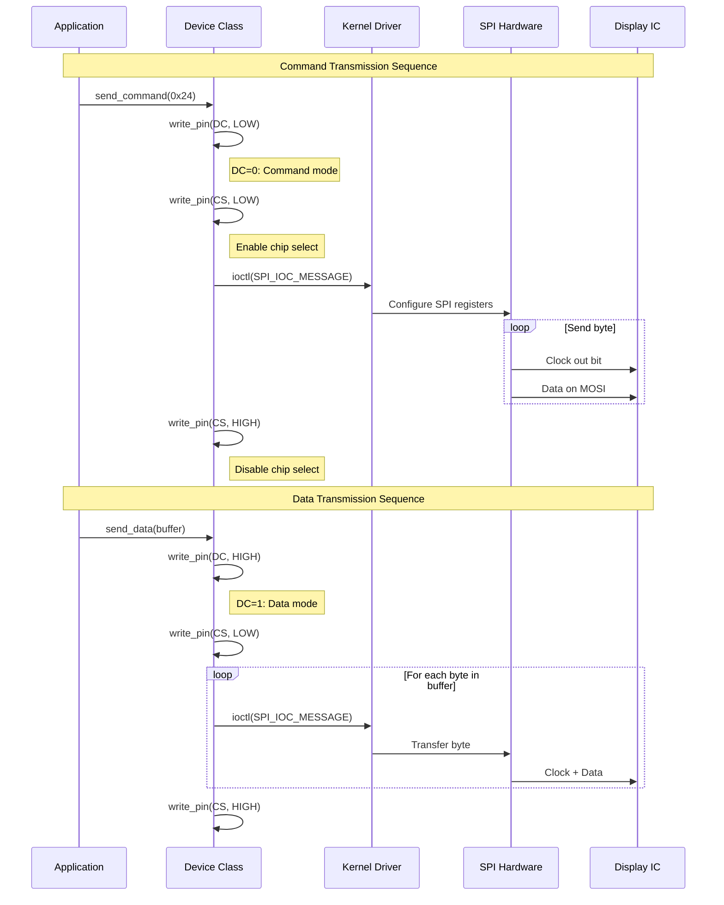

### GPIO Control Flow

```mermaid
flowchart TD
    A[Application] --> B[Device::write_pin]
    B --> C[BCM2835 Library]
    C --> D[/dev/gpiomem]
    D --> E[Memory Mapped Registers]
    E --> F[GPIO Controller]
    F --> G[Physical Pin]
    G --> H[Display Pin]

    I[Display Controller] --> J[BUSY Pin Output]
    J --> K[Physical Pin]
    K --> L[GPIO Controller]
    L --> M[Memory Mapped Registers]
    M --> N[/dev/gpiomem]
    N --> O[BCM2835 Library]
    O --> P[Device::read_pin]
    P --> Q[Application]

    style A fill:#e3f2fd
    style H fill:#cfd8dc
    style I fill:#cfd8dc
    style Q fill:#e3f2fd
```

### Timing Diagram

```mermaid
gantt
    title SPI Transaction Timing (Command + Data)
    dateFormat X
    axisFormat %L μs

    section GPIO
    DC = LOW (Cmd)     :0, 1
    CS = LOW           :1, 1
    CS = HIGH          :10, 1
    DC = HIGH (Data)   :11, 1
    CS = LOW           :12, 1
    CS = HIGH          :5010, 1

    section SPI
    Send Command Byte  :2, 8
    Send Data (5KB)    :13, 5000

    section Display
    Process Command    :11, 10
    Store Data in RAM  :13, 5000
    BUSY = HIGH        :5011, 2000000
```

**Notes**:
- Command transmission: ~10 μs
- Data transmission (5KB): ~5 ms @ 8 MHz SPI clock
- Display refresh: ~2-3 seconds (BUSY signal HIGH)

---

## System Integration

### Deployment Context

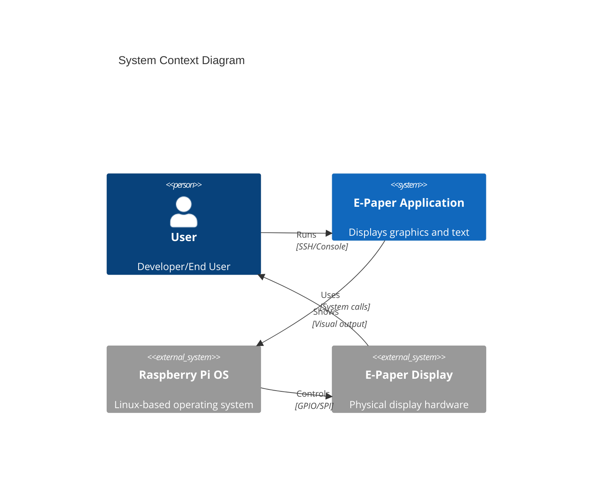

### Container Diagram

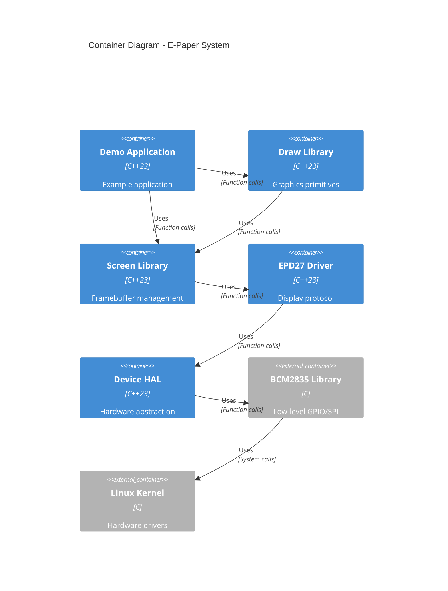

### Component Interactions

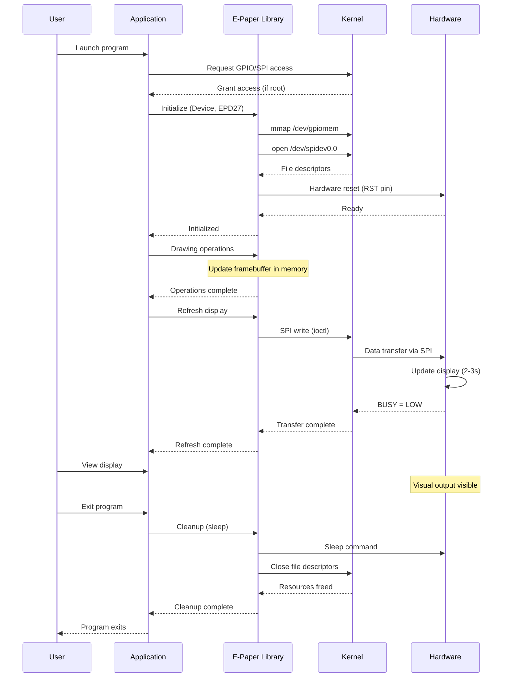

---

## Resource Management

### Resource Lifecycle

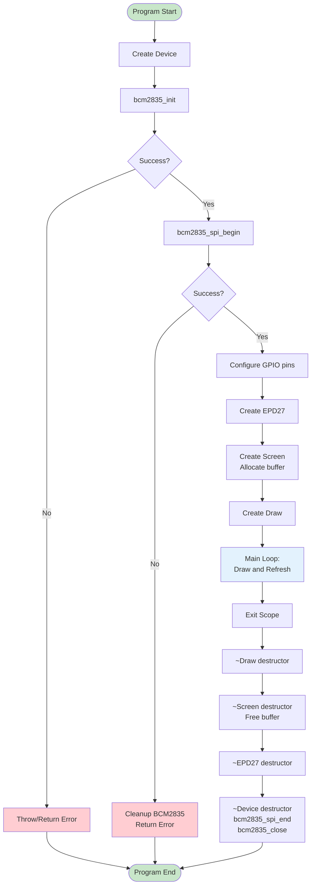

### Resource Ownership

```mermaid
graph TD
    subgraph "Application Scope"
        APP_MAIN[main function]
    end

    subgraph "Owned Resources"
        OWN_DEV[Device<br/>Owns: BCM2835 init]
        OWN_EPD[EPD27<br/>Owns: Display state]
        OWN_SCR[Screen<br/>Owns: Buffer memory]
        OWN_DRW[Draw<br/>Owns: Nothing]
    end

    subgraph "Referenced Resources"
        REF_DEV[Device& reference]
        REF_EPD[Driver& reference]
        REF_SCR[Screen& reference]
    end

    subgraph "System Resources"
        SYS_GPIO[/dev/gpiomem]
        SYS_SPI[/dev/spidev0.0]
        SYS_MEM[Heap Memory]
    end

    APP_MAIN -->|owns| OWN_DEV
    APP_MAIN -->|owns| OWN_EPD
    APP_MAIN -->|owns| OWN_SCR
    APP_MAIN -->|owns| OWN_DRW

    OWN_EPD -->|references| REF_DEV
    OWN_SCR -->|references| REF_EPD
    OWN_DRW -->|references| REF_SCR

    OWN_DEV -.->|acquires| SYS_GPIO
    OWN_DEV -.->|acquires| SYS_SPI
    OWN_SCR -.->|allocates| SYS_MEM

    style APP_MAIN fill:#e3f2fd
    style OWN_DEV fill:#c8e6c9
    style OWN_EPD fill:#c8e6c9
    style OWN_SCR fill:#c8e6c9
    style OWN_DRW fill:#c8e6c9
    style SYS_GPIO fill:#ffccbc
    style SYS_SPI fill:#ffccbc
    style SYS_MEM fill:#ffccbc
```

### Memory Allocation Timeline

```mermaid
gantt
    title Memory Allocation During Execution
    dateFormat X
    axisFormat %L ms

    section Initialization
    BCM2835 init         :0, 50
    GPIO configuration   :50, 20
    SPI configuration    :70, 20

    section Buffer Allocation
    Screen buffer (5.8KB) :90, 5

    section Execution
    Drawing operations    :100, 10

    section Display
    SPI transfer (5KB)    :110, 5
    Display refresh       :115, 2000

    section Cleanup
    Free buffer           :2120, 1
    Close SPI             :2121, 10
    Close BCM2835         :2131, 20
```

---

## Deployment Scenarios

### Scenario 1: Development Environment

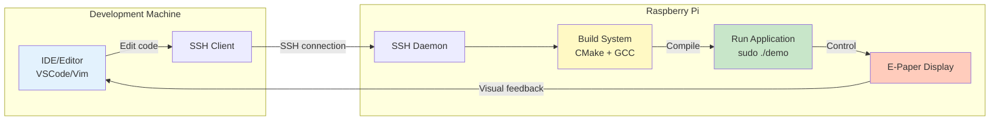

### Scenario 2: Production Deployment

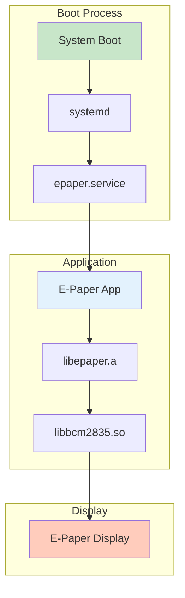

**systemd service example**:

```ini
[Unit]
Description=E-Paper Display Service
After=multi-user.target

[Service]
Type=simple
User=root
WorkingDirectory=/opt/epaper
ExecStart=/opt/epaper/bin/epaper_app
Restart=on-failure

[Install]
WantedBy=multi-user.target
```

### Scenario 3: Embedded System

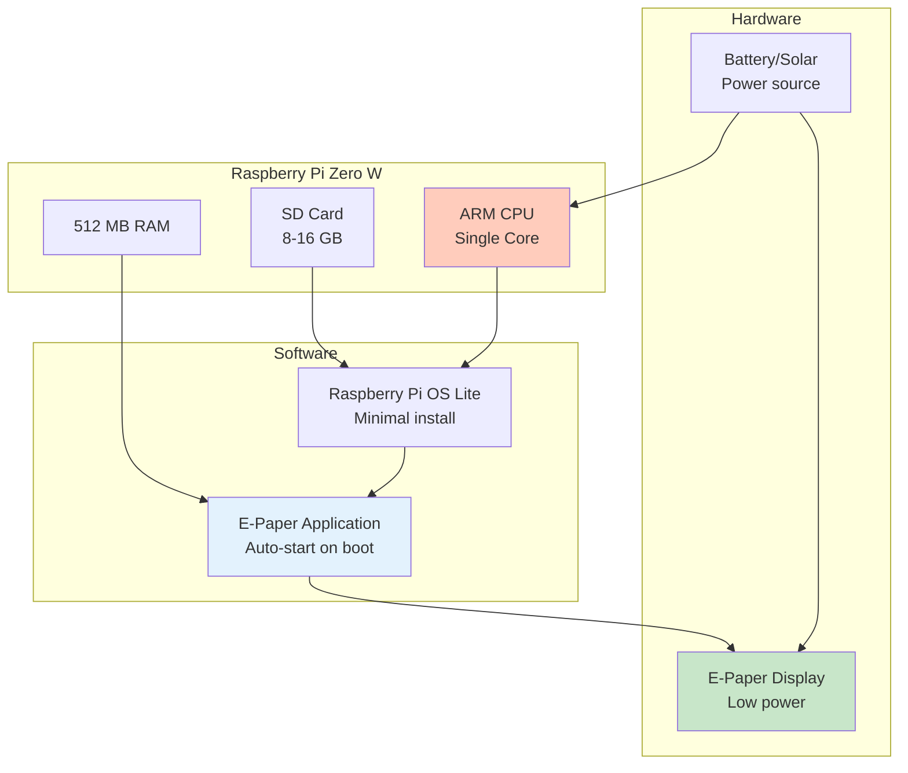

---

## Performance Characteristics

### System Resource Usage

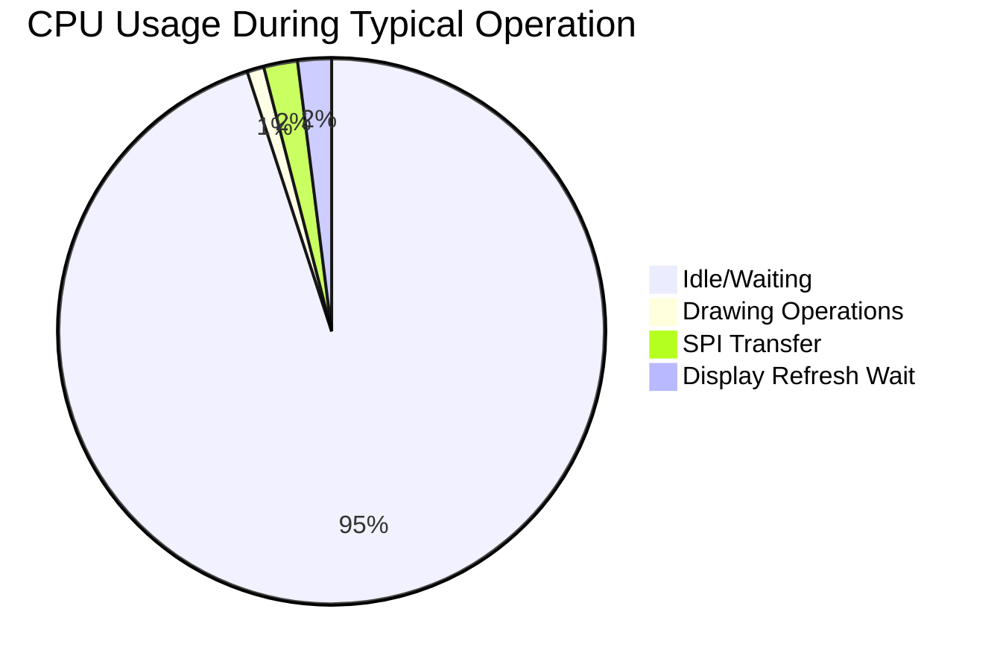

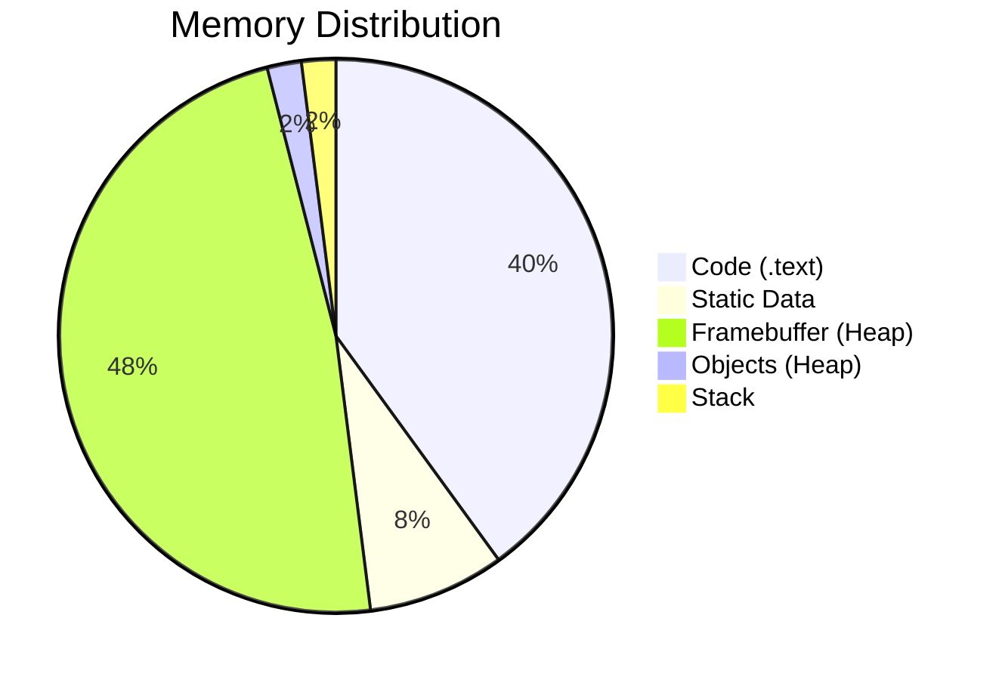

### Bottleneck Analysis

| Component | Performance | Bottleneck? |
|-----------|-------------|-------------|
| **Drawing Operations** | <1ms for typical scene | ❌ No |
| **Framebuffer Update** | <1μs per pixel | ❌ No |
| **SPI Transfer** | ~5ms for 5KB @ 8MHz | ⚠️ Minor |
| **Display Refresh** | 2-3 seconds | ✅ **Major** |
| **Memory Bandwidth** | >1 GB/s | ❌ No |
| **CPU Utilization** | <5% during drawing | ❌ No |

**Conclusion**: The physical e-ink display refresh time (2-3 seconds) is the primary bottleneck. This is a hardware limitation, not software.

---

## Security Considerations

### Privilege Requirements

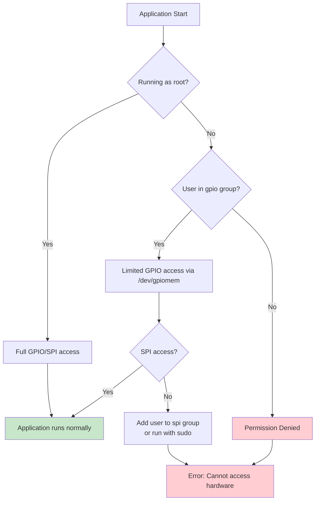

### Best Practices

| Practice | Recommendation | Rationale |
|----------|----------------|-----------|
| **Development** | Use `sudo` | Full access, easier debugging |
| **Production** | Add user to `gpio` and `spi` groups | Principle of least privilege |
| **Service** | Run as dedicated user with group permissions | Security isolation |
| **Testing** | Use mock hardware layer | No root required for unit tests |

---

## Monitoring and Debugging

### Debug Information Flow

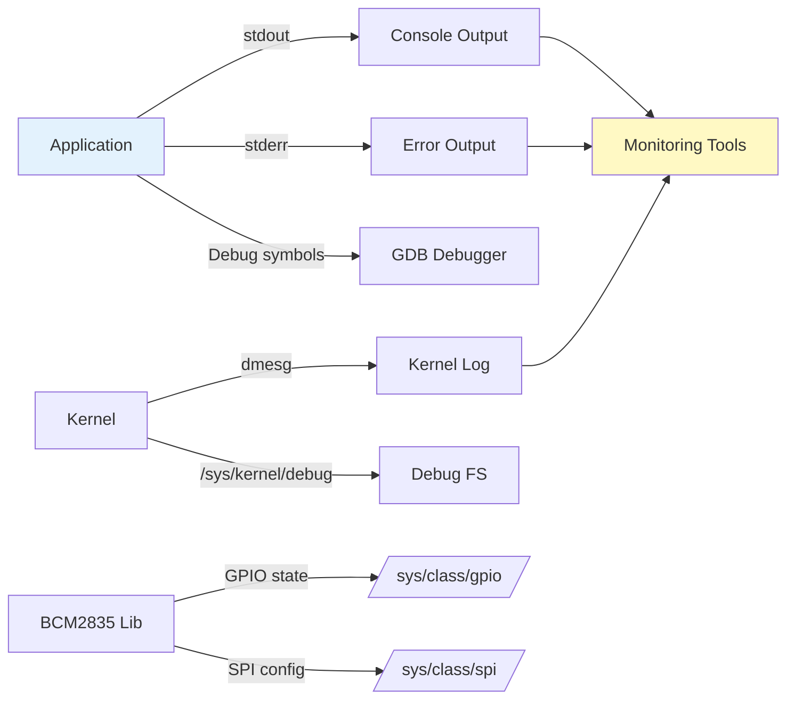

### Diagnostic Commands

```bash
# Check GPIO state
cat /sys/kernel/debug/gpio

# Check SPI devices
ls -l /dev/spi*

# Monitor system calls
strace -e open,ioctl,mmap ./epaper_demo

# Profile application
perf record ./epaper_demo
perf report

# Memory debugging
valgrind --leak-check=full ./epaper_demo

# Monitor hardware signals (requires logic analyzer)
# Connect to GPIO pins and observe SPI/GPIO signals
```

---

## Scalability and Extensions

### Multi-Display Support

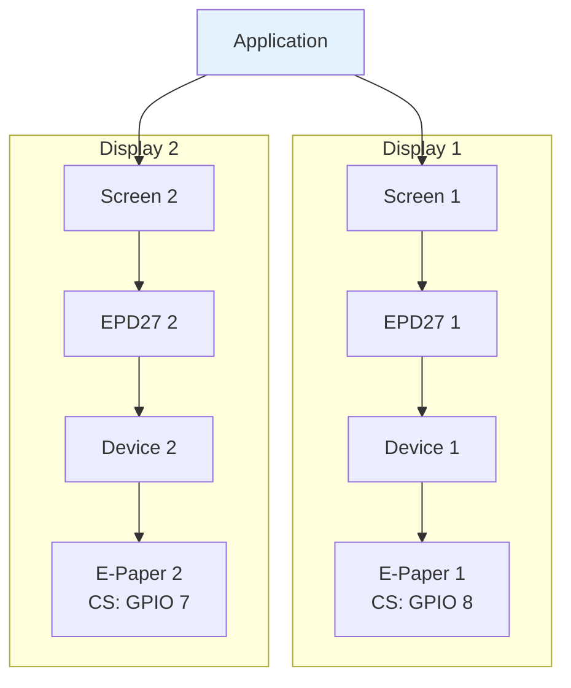

**Note**: Each display requires separate chip select (CS) pin and Device instance.

---

## Summary

This deployment architecture demonstrates:

1. **Clear separation** between software layers and hardware
2. **Efficient resource management** through RAII and ownership
3. **System integration** via standard Linux interfaces
4. **Performance characteristics** dominated by display hardware
5. **Security considerations** for GPIO/SPI access
6. **Extensibility** for multiple displays or new hardware

The architecture is suitable for:
- **Development**: Rapid prototyping and debugging
- **Production**: Embedded systems and IoT devices
- **Education**: Learning embedded Linux and hardware interfacing

---

*For detailed component architecture, see `ARCHITECTURE.md`*
*For quick API reference, see `ARCHITECTURE_QUICK_REFERENCE.md`*

