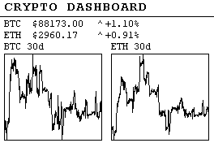

# Crypto Dashboard - Multi-Screen Price Display

A modern cryptocurrency price dashboard application for e-Paper displays, built with C++23. Displays BTC and ETH prices with rotating screens showing 30-day and 6-month price graphs.

## 🏗️ Architecture

This application demonstrates:

- ✅ **Modern C++23** patterns and features
- ✅ **Transparent sleep/wake** - auto-sleep enabled, no manual management needed
- ✅ **Composition over inheritance** design
- ✅ **Separation of concerns** with clear module boundaries
- ✅ **RAII** resource management
- ✅ **`std::expected`** for error handling
- ✅ **Const correctness** throughout
- ✅ **Value semantics** where appropriate

### Directory Structure

```
crypto_dashboard/
├── include/              # Public headers
│   ├── types.hpp        # Data structures (CryptoPrice, PriceHistory, etc.)
│   ├── http_client.hpp  # HTTP client (cURL wrapper)
│   ├── crypto_api.hpp   # API clients (CoinGecko)
│   └── dashboard_renderer.hpp  # Display rendering
├── src/                 # Implementation files
│   ├── main.cpp         # Application entry point
│   ├── types.cpp
│   ├── http_client.cpp
│   ├── crypto_api.cpp
│   └── dashboard_renderer.cpp
├── CMakeLists.txt       # Build configuration
└── README.md            # This file
```

## 🎯 Features

### Multi-Screen Display

The dashboard rotates through 3 screens automatically:

1. **Combined Screen**: Shows BTC and ETH current prices with two 30-day graphs side-by-side
2. **BTC Dedicated Screen**: Shows BTC price with stacked 30-day (top) and 6-month (bottom) graphs
3. **ETH Dedicated Screen**: Shows ETH price with stacked 30-day (top) and 6-month (bottom) graphs

### Configurable Intervals

- **Screen Flip Interval**: How often screens rotate (default: 60 seconds)
- **Data Fetch Interval**: How often price data is fetched from APIs (default: 900 seconds = 15 minutes)

Data fetching and screen rotation operate independently - screens rotate using cached data until new data is fetched.

## 🎯 Design Principles

### 1. Composition Over Inheritance

Instead of deep inheritance hierarchies, we use composition:

```cpp
// CryptoDataFetcher composes multiple API clients
class CryptoDataFetcher {
private:
  const HTTPClient& client_;          // Composed HTTP client
  CoinGeckoAPI coingecko_api_;        // Composed API client
};
```

### 2. Modern Error Handling

Using `std::expected` for type-safe error propagation:

```cpp
[[nodiscard]] auto fetch_price(const std::string& symbol) const
    -> std::expected<CryptoPrice, std::string>;
```

### 3. RAII and Resource Management

```cpp
class HTTPClient {
  // Pimpl idiom hides cURL implementation details
  struct Impl;
  std::unique_ptr<Impl> impl_;

  // Movable but not copyable
  HTTPClient(HTTPClient&&) noexcept;
  HTTPClient& operator=(HTTPClient&&) noexcept;
};
```

### 4. Value Semantics

Data structures are simple value types:

```cpp
struct CryptoPrice {
  std::string symbol;
  double price = 0.0;
  bool valid = false;

  [[nodiscard]] constexpr auto is_valid() const noexcept -> bool;
};
```

### 5. Clear Separation of Concerns

Each module has a single, well-defined responsibility:

| Module | Responsibility |
|--------|---------------|
| `types.hpp` | Data structures and domain types |
| `http_client.hpp` | HTTP communication (cURL wrapper) |
| `crypto_api.hpp` | External API interactions (CoinGecko) |
| `dashboard_renderer.hpp` | Display rendering logic |
| `main.cpp` | Application lifecycle and orchestration |

## 🚀 Building

### Prerequisites

```bash
sudo apt-get install \
    libcurl4-openssl-dev \
    nlohmann-json3-dev \
    libbcm2835-dev
```

### Build Commands

```bash
# From the e-Paper root directory
cd /home/jg/code/e-Paper

# Configure
cmake -B build -S .

# Build just the crypto dashboard
cmake --build build --target crypto_dashboard -j$(nproc)

# Install
sudo cmake --install build
```

The executable will be at: `build/examples/crypto_dashboard/crypto_dashboard`

## 📖 Usage

### Basic Usage

```bash
# Run with default settings (60s screen flip, 15min data fetch)
sudo ./crypto_dashboard

# Custom screen flip interval (30 seconds)
sudo ./crypto_dashboard --screen-flip-interval=30

# Custom data fetch interval (10 minutes)
sudo ./crypto_dashboard --data-fetch-interval=600

# Both custom intervals
sudo ./crypto_dashboard --screen-flip-interval=45 --data-fetch-interval=1200

# Show help
./crypto_dashboard --help
```

### Command-Line Options

- `--screen-flip-interval=SECONDS`: Interval between screen rotations (default: 60)
- `--data-fetch-interval=SECONDS`: Interval between data fetches (default: 900 = 15 minutes)
- `--help, -h`: Show help message

## 🔧 Module Details

### HTTPClient

- Wraps libcurl with RAII
- Movable but not copyable
- Uses Pimpl idiom to hide implementation
- Returns `std::expected` for error handling

### CryptoAPI

- **CoinGeckoAPI**: Fetches prices and historical data
- **CryptoDataFetcher**: High-level aggregator

All use composition instead of inheritance.

### DashboardRenderer

- Handles all e-Paper display rendering
- Supports 3 screen types: Combined, BTC Dedicated, ETH Dedicated
- Modular drawing methods
- Clean separation from data fetching

## 🎨 Screen Layouts

### Screen 1: Combined View (264x176 landscape)

BTC and ETH prices with 30-day charts side-by-side:



### Screen 2: Dedicated View (264x176 landscape)

Individual cryptocurrency with 30-day and 6-month charts stacked:


## 🧪 Testing

```bash
# Test build
cmake --build build --target crypto_dashboard

# Test with help
./build/examples/crypto_dashboard/crypto_dashboard --help

# Full test
sudo ./build/examples/crypto_dashboard/crypto_dashboard
```

## 🎨 Benefits of This Design

### Advantages

1. **Testability**: Each module can be tested in isolation
2. **Reusability**: HTTP client and API clients can be reused
3. **Maintainability**: Changes are localized to specific modules
4. **Readability**: Each file has a clear, focused purpose
5. **Extensibility**: Easy to add new features or APIs
6. **Type Safety**: `std::expected` catches errors at compile time
7. **Efficient**: Data fetching and screen rotation are independent, reducing API calls

## 📝 TODO / Future Improvements

- [ ] Support for more cryptocurrencies
- [ ] Configurable display layouts
- [ ] Historical data persistence

## 🤝 Contributing

This is an example project demonstrating modern C++ design. Feel free to:

- Use it as a template for your own projects
- Extend it with new features
- Improve the design further
- Share your improvements!

## 📄 License

Same as the parent e-Paper project.

## 🙏 Acknowledgments

- Original monolithic implementation
- CoinGecko API for crypto data
- nlohmann/json library
- libcurl library
